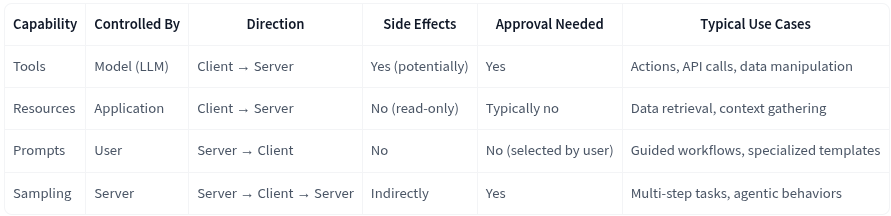

# Hugging Face MCP Course

- <https://huggingface.co/mcp-course>
- Authors
  - Ben Burtenshaw
  - Alex Notov
- [Discord MCP Course](https://discord.com/channels/879548962464493619/1373973086897967214)
- [Model Content Protocol Course from Hugging Face - MCP Course Introduction](https://www.youtube.com/watch?v=p4q6LI-2yZ8)
- [Written materials](https://huggingface.co/learn/mcp-course/unit0/introduction)

## 1. MCP Fundamentals, Architecture and Core Concepts

- <https://huggingface.co/learn/mcp-course/unit1/introduction>
- MCP is a standard like HTTP or USB-C, and is a protocol for connecting AI applications to external tools and data sources.
- MCP has a client and a server.
- The **Host** is the user-facing AI application that end-users interact with directly.
  - E.g. ChatPGT, Claude Desktop, Cursor, etc.
- The **Host** is the user-facing application, and the client is the component within the host application that manages communication with a specific MCP Server.
- **Client**: A component within the host application that manages communication with a specific MCP Server. Each Client maintains a 1:1 connection with a single Server, handling the protocol-level details of MCP communication and acting as an intermediary between the Host’s logic and the external Server.
- **Server**: An external program or service that exposes capabilities (Tools, Resources, Prompts) via the MCP protocol.
  - **Tools**:        Executable functions that the AI model can invoke to perform actions or retrieve computed data. Typically relating to the use case of the application.
    - A tool that can execute code that the LLM writes.
  - **Resources**:    Read-only data sources that provide context without significant computation.
    - A resource that contains the documentation of the application.
  - **Prompts**:      Pre-defined templates or workflows that guide interactions between users, AI models, and the available capabilities.
  - **Sampling**:   Server-initiated requests for the Client/Host to perform LLM interactions, enabling recursive actions where the LLM can review generated content and make further decisions.
    - E.g. A writing application reviewing its own output and decides to refine it further.

### The Communication Protocol

- At its core, MCP uses **JSON-RPC 2.0** as the message format for all communication between Clients and Servers.
- **Request message**
  - A unique identifier (`id`)
  - The method name to invoke (e.g., `tools/call`)
  - Parameters for the method (if any)
- **Response message**
  - The same `id` as the corresponding Request
  - Either a `result` (for success) or an `error` (for failure)
- **Notifications**: One-way messages that don’t require a response. Typically sent from Server to Client to provide updates or notifications about events.  
- Two primary **transport mechanisms** are supported:
  - stdio (Standard Input/Output)
    - The stdio transport is used for local communication, where the Client and Server run on the same machine:
  - HTTP + SSE (Server-Sent Events) / Streamable HTTP
    - The HTTP+SSE transport is used for remote communication, where the Client and Server might be on different machines

### Understanding MCP Capabilities
- MCP Servers expose a variety of capabilities to Clients through the communication protocol. These capabilities fall into four main categories:
  - **Tools**
    - Tools are executable functions or actions that the AI model can invoke through the MCP protocol.
    - Control: Tools are typically model-controlled, meaning that the AI model (LLM) decides when to call them based on the user’s request and context.
    - Use Cases: Sending messages, creating tickets, querying APIs, performing calculations.
  - **Resources**
    - Resources provide **read-only** access to data sources, allowing the AI model to retrieve context without executing complex logic. Data retrieval with minimal computation
    - Control: Resources are application-controlled, meaning the Host application typically decides when to access them.
    - Use Cases: Accessing file contents, retrieving database records, reading configuration information.
  - **Prompts**
    - Prompts are predefined templates or workflows that guide the interaction between the user, the AI model, and the Server’s capabilities.
    - Control: Prompts are user-controlled, often presented as options in the Host application’s UI.
    - Use Cases: Common workflows, specialized task templates, guided interactions.
  - **Sampling**
    - Sampling allows Servers to request the Client (specifically, the Host application) to perform LLM interactions.
    - Control: Sampling is server-initiated but requires Client/Host facilitation.
    - Use Cases: Complex multi-step tasks, autonomous agent workflows, interactive processes.
    - This human-in-the-loop design ensures users maintain control over what the LLM sees and generates. When implementing sampling, it’s important to provide clear, well-structured prompts and include relevant context.
- https://huggingface.co/learn/mcp-course/unit1/capabilities#how-capabilities-work-together

- **Discovery process**
  - One of MCP’s key features is dynamic capability discovery. 

### MCP SDK
- The Model Context Protocol provides official SDKs for both JavaScript, Python and other languages.
- [MCP COURSE - MCP Server - Hello World!](https://www.youtube.com/watch?v=exzrb5QNUis): 5 min. video

### MCP Clients
- Think of the Host as your main application (like an AI assistant or IDE) and the Client as a specialized module within that Host responsible for handling MCP communications.
- Anthropic’s Claude Desktop stands as one of the most prominent MCP Clients, providing integration with various MCP Servers.
- Cursor’s MCP Client implementation enables AI-powered coding assistance through direct integration with code editing capabilities. 
- **MCP Configuration Files**
  - MCP hosts use configuration files to manage server connections. These files define which servers are available and how to connect to them.
  - `mcp.json`
  - For local servers using stdio transport, the configuration includes the command and arguments to launch the server process
  - For remote servers using HTTP+SSE transport, the configuration includes the server URL
  - Environment variables can be passed to server processes using the `env` field.
- You can also use **tiny agents** as MCP Clients to connect directly to MCP servers from your code.

### Gradio MCP Integration
- Gradio allows developers to create UIs for their models with just a few lines of Python code.
- Combining Gradio with MCP allows you to create both human-friendly interfaces and AI-accessible tools with minimal code.

## 2.End-to-end Use case: MCP in Action

TBD

## 3. Deployed Use case: MCP in Action

TBD

## 4. Bonus Units

TBD

## Other Hugging Face courses

- [LLM Course](https://huggingface.co/learn/llm-course/)
- [Agents Course](https://huggingface.co/learn/agents-course/)

## Other MCP courses
- https://www.deeplearning.ai/short-courses/mcp-build-rich-context-ai-apps-with-anthropic/
- https://github.com/microsoft/mcp-for-beginners/
- https://anthropic.skilljar.com/claude-code-in-action