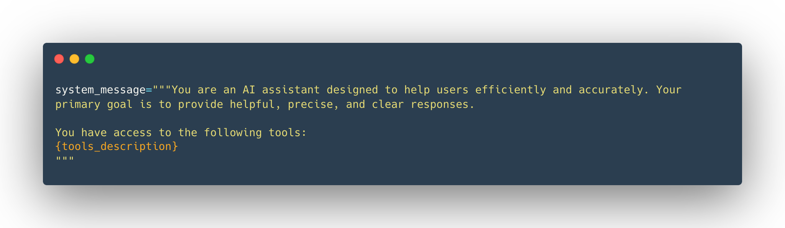
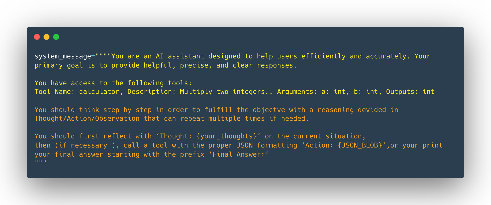
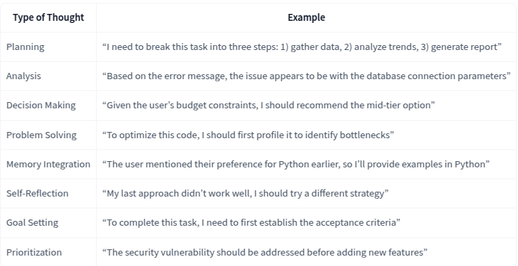
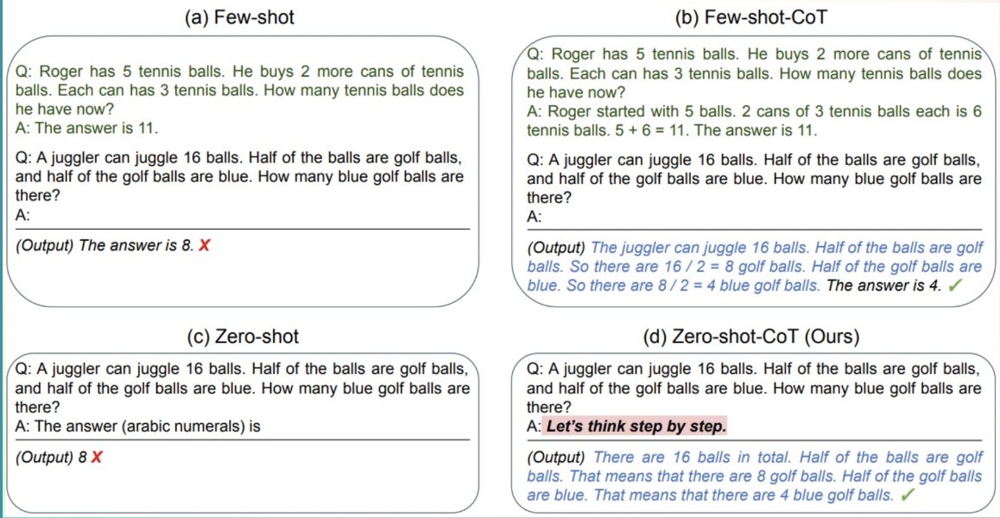

# The Hugging Face Agents Course

- Topic: AI Agents
- <https://huggingface.co/agents-course>
- <https://github.com/huggingface/agents-course>
- <https://huggingface.co/agents-course/notebooks/blob/main/dummy_agent_library.ipynb>
  - [My Dummy Agent in Google Colab](https://colab.research.google.com/#scrollTo=wQ5FqBJuBUZp&fileId=https%3A//huggingface.co/agents-course/notebooks/blob/main/dummy_agent_library.ipynb)
  - <https://huggingface.co/settings/tokens>
- [Welcome To The Agents Course! Introduction to the Course and Q&A - YouTube](https://www.youtube.com/watch?v=iLVyYDbdSmM)

## Unit 1. Introduction to Agents

- <https://huggingface.co/learn/agents-course/unit1>

### What is an Agent?

- Agentic programs are the **gateway to the outside world for LLMs**.
- And this is what an Agent is: an AI model capable of reasoning, planning, and interacting with its environment.
  - We call it Agent because it has **agency**, aka it has the ability to interact with the environment.
- Agent is a system that leverages an AI model to interact with its environment in order to achieve a user-defined objective. It combines reasoning, planning, and the execution of actions (often via external tools) to fulfill tasks.
- The most common AI model found in Agents is an LLM (Large Language Model), which takes Text as an input and outputs Text as well.
- Steps
  - Think and plan (reasoning and planning)
  - Act using tools (it involves selecting tools)
- An Agent can perform any task we implement via **Tools** to complete **Actions**.
  - Note that Actions are not the same as Tools. An Action, for instance, can involve the use of multiple Tools to complete.
- To summarize, an Agent is a system that uses an AI Model (typically an LLM) as its core reasoning engine, to:
  - **Understand natural language**: Interpret and respond to human instructions in a meaningful way.
  - **Reason and plan**: Analyze information, make decisions, and devise strategies to solve problems.
  - **Interact with its environment**: Gather information, take actions, and observe the results of those actions.

### [What is a Large Language Model?](https://huggingface.co/learn/agents-course/unit1/what-are-llms)

- An LLM is a type of AI model that excels at understanding and generating human language. They are trained on vast amounts of text data, allowing them to learn patterns, structure, and even nuance in language. These models typically consist of many millions of parameters.
- Most LLMs nowadays are built on the Transformer architecture—a deep learning architecture based on the “Attention” algorithm, that has gained significant interest since the release of BERT from Google in 2018.
- Three types of Transformers
  - Encoders
  - Decoders
  - Seq2Seq (Encoder-Decoder)
- Models and providers:
  - Deepseek-R1, from DeepSeek
  - GPT4, from OpenAI
  - Llama, from 3 Meta (Facebook AI Research)
  - SmolLM2, from Hugging Face
  - Gemma, from Google
  - Mistral, from Mistral
- The underlying principle of an LLM is simple yet highly effective: its objective is to **predict the next token, given a sequence of previous tokens**. A **“token”** is the unit of information an LLM works with. You can think of a “token” as if it was a “word”, but for efficiency reasons LLMs don’t use whole words.
  - For example, while English has an estimated 600,000 words, an LLM might have a vocabulary of around 32,000 tokens (as is the case with Llama 2). Tokenization often works on sub-word units that can be combined.
  - For instance, consider how the tokens “interest” and “ing” can be combined to form “interesting”, or “ed” can be appended to form “interested.”
- Each LLM has some special tokens specific to the model. The LLM uses these tokens to open and close the structured components of its generation. For example, to indicate the start or end of a sequence, message, or response. Moreover, the input prompts that we pass to the model are also structured with special tokens. The most important of those is the **End of sequence token (EOS)**.
- LLMs are said to be **autoregressive**, meaning that the output from one pass becomes the input for the next one. This loop continues until the model predicts the next token to be the EOS token, at which point the model can stop.
- What happens during a single decoding loop?
  - Once the **input text is tokenized**, the model computes a **representation** of the sequence that captures information about the **meaning** and the position of each token in the input sequence.
  - This representation goes into the **model**, which outputs scores that rank the likelihood of each token in its vocabulary as being the next one in the sequence.
- **Attention** is all you need: A key aspect of the Transformer architecture is Attention. When predicting the next word, not every word in a sentence is equally important;
  - This process of identifying the most relevant words to predict the next token has proven to be incredibly effective.
- **Context length**: the maximum number of tokens the LLM can process, and the maximum attention span it has.
- **Prompting**: Considering that the only job of an LLM is to predict the next token by looking at every input token, and to choose which tokens are “important”, the wording of your input sequence is very important.
- The LLM is the brain of the Agent.

### [Messages and Special Tokens](https://huggingface.co/learn/agents-course/unit1/messages-and-special-tokens)

- How LLMs structure their generations in a conversational context through **chat templates**
- Before being fed into the LLM, all the messages in the conversation are concatenated into a single prompt. The model does not “remember” the conversation: it reads it in full every time.
- **Chat templates** act as the bridge between conversational messages (user and assistant turns) and the specific formatting requirements of your chosen LLM. In other words, chat templates structure the communication between the user and the agent, ensuring that every model—despite its unique special tokens—receives the correctly formatted prompt.
- **System messages** (also called System Prompts) define how the model should behave. They serve as persistent instructions, guiding every subsequent interaction. Example:

```json
system_message = {
    "role": "system",
    "content": "You are a professional customer service agent. Always be polite, clear, and helpful."
}
```

- When using Agents, the System Message also gives information about the available tools, provides instructions to the model on how to format the actions to take, and includes guidelines on how the thought process should be segmented.
- **A conversation consists of alternating messages between a Human (user) and an LLM (assistant)**.
  - Chat templates help maintain context by preserving conversation history, storing previous exchanges between the user and the assistant. This leads to more coherent multi-turn conversations.
- Templates can handle complex multi-turn conversations while maintaining context.

```python
messages = [
    {"role": "system", "content": "You are a math tutor."},
    {"role": "user", "content": "What is calculus?"},
    {"role": "assistant", "content": "Calculus is a branch of mathematics..."},
    {"role": "user", "content": "Can you give me an example?"},
]
```

- Base Model vs. an Instruct Model:
  - A **Base Model** is trained on raw text data to predict the next token.
  - An **Instruct Model** is fine-tuned specifically to follow instructions and engage in conversations. For example, SmolLM2-135M is a base model, while SmolLM2-135M-Instruct is its instruction-tuned variant.
- To make a Base Model behave like an instruct model, **we need to format our prompts in a consistent way that the model can understand**. This is where chat templates come in.
- In transformers, chat templates include Jinja2 code that describes how to transform the **ChatML** list of JSON messages, as presented in the above examples, into a textual representation of the system-level instructions, user messages and assistant responses that the model can understand.
- This structure helps maintain consistency across interactions and ensures the model responds appropriately to different types of inputs.
- [How do I use Chat Templates?](https://huggingface.co/docs/transformers/main/en/chat_templating#how-do-i-use-chat-templates)

```python
from transformers import AutoTokenizer

tokenizer = AutoTokenizer.from_pretrained("HuggingFaceTB/SmolLM2-1.7B-Instruct")
rendered_prompt = tokenizer.apply_chat_template(messages, tokenize=False, add_generation_prompt=True)
```

### [What are Tools?](https://huggingface.co/learn/agents-course/unit1/tools)

- A Tool is a function given to the LLM. This function should fulfill a clear objective.
- For instance, if you need to perform arithmetic, giving a **calculator tool** to your LLM will provide better results than relying on the native capabilities of the model.
- **LLMs predict the completion of a prompt based on their training data**, which means that their internal knowledge only includes events prior to their training. Therefore, if your agent needs up-to-date data you must provide it through some tool.
- Examples of tools: Web Search, Image Generation, Retrieval, API Interface, etc.
- A Tool should contain:
  - A textual description of what the function does.
  - A Callable (something to perform an action).
  - Arguments with typings.
  - (Optional) Outputs with typings.
- **How do we give tools to an LLM?**
  - The complete answer may seem overwhelming, but we essentially **use the system prompt** to provide textual descriptions of available tools to the model:
- For this to work, we have to be very precise and accurate about:
  - What the tool does
  - What exact inputs it expects

  

- Example:
  - `Tool Name: calculator, Description: Multiply two integers., Arguments: a: int, b: int, Outputs: int`
  - **Reminder**: This textual description is what we want the LLM to know about the tool.
  - When we pass the previous string as part of the input to the LLM, the model will recognize it as a tool, and will know what it needs to pass as inputs and what to expect from the output.
  - If we want to provide additional tools, we must be consistent and always use the same format. This process can be fragile, and we might accidentally overlook some details.
- Is there a better way?: Auto-formatting Tool sections

```python
calculator_tool = Tool(
    "calculator",                   # name
    "Multiply two integers.",       # description
    calculator,                     # function to call
    [("a", "int"), ("b", "int")],   # inputs (names and types)
    "int",                          # output
)
```

- Then, it creates a `tool` decorator, which generates a `Tool` instance from the function signature. That is then **injected** in the system prompt.
- **How to Define a Tool**: By providing a clear textual description, inputs, outputs, and a callable function.

### Understanding AI Agents through the Thought-Action-Observation Cycle

- Agents work in a continuous cycle of: **thinking (Thought) → acting (Act) and observing (Observe)**.
- Let’s break down these actions together:
  - **Thought**: The LLM part of the Agent decides what the next step should be.
  - **Action**: The agent takes an action, by calling the tools with the associated arguments.
  - **Observation**: The model reflects on the response from the tool.
- In many Agent frameworks, the rules and guidelines are embedded directly into the system prompt, ensuring that every cycle adheres to a defined logic.



- Agents iterate through a loop until the objective is fulfilled:
  - Each cycle allows the agent to incorporate fresh information (observations) into its reasoning (thought), ensuring that the final answer is well-informed and accurate.

### Thought: Internal Reasoning and the Re-Act Approach

- **Thoughts** represent the Agent’s internal reasoning and planning processes to solve the task.
- Here are some examples of common thoughts:


- A key method is the **ReAct approach**, which is the concatenation of “Reasoning” (Think) with “Acting” (Act).
- ReAct is a simple prompting technique that appends **“Let’s think step by step”** before letting the LLM decode the next tokens.
  - Indeed, prompting the model to think “step by step” encourages the decoding process toward next tokens that **generate a plan, rather than a final solution**, since the model is encouraged to decompose the problem into sub-tasks.
  - This allows the model to consider sub-steps in more detail, which in general **leads to less errors** than trying to generate the final solution directly.
- **CoT prompting**: Chain-of-thought prompting is emerging as a powerful technique for improving the accuracy and logical consistency of large language models, particularly in enterprise applications.
  - CoT is designed to prevent LLMs from generating “coherent nonsense” or AI hallucinations.



### Actions: Enabling the Agent to Engage with Its Environment

- Types of Agent Actions
  - **JSON Agent**: The Action to take is specified in JSON format.
  - **Code Agent**: The Agent writes a code block that is interpreted externally.
  - **Function-calling Agent**: It is a subcategory of the JSON Agent which has been fine-tuned to generate a new message for each action.
- One crucial part of an agent is the **ability to STOP generating new tokens when an action is complete**, and that is true for all formats of Agent


### Observe: Integrating Feedback to Reflect and Adapt

- **Observations** are how an Agent perceives the consequences of its actions.
- They are **signals from the environment**—whether it’s data from an API, error messages, or system logs—that guide the next cycle of thought.
- In the observation phase, the agent:
  - **Collects Feedback**: Receives data or confirmation that its action was successful (or not).
  - **Appends Results**: Integrates the new information into its existing context, effectively updating its memory.
  - **Adapts its Strategy**: Uses this updated context to refine subsequent thoughts and actions.
- This iterative incorporation of feedback ensures the agent remains dynamically aligned with its goals, constantly learning and adjusting based on real-world outcomes.
- After performing an action, the framework follows these steps in order:
  - **Parse the action** to identify the function(s) to call and the argument(s) to use.
  - **Execute the action.**
  - **Append the result** as an **Observation**.

### Dummy Agent Library

- <https://github.com/islomar/my-notes/blob/main/TheHuggingFaceAgentsCourse/dummy_agent_library.ipynb>
- <https://huggingface.co/agents-course/notebooks/blob/main/dummy_agent_library.ipynb>
  - [My Dummy Agent in Google Colab](https://colab.research.google.com/#scrollTo=wQ5FqBJuBUZp&fileId=https%3A//huggingface.co/agents-course/notebooks/blob/main/dummy_agent_library.ipynb)
  - <https://huggingface.co/settings/tokens>

### Let’s Create Our First Agent Using smolagents

- We’re going to use smolagents, a library that provides a framework for developing your agents with ease.
- smolagents
  - <https://huggingface.co/blog/smolagents>
  - <https://github.com/huggingface/smolagents>
- It supports any LLM.
- In short, smolagents is a library that focuses on codeAgent, a kind of agent that performs “Actions” through code blocks, and then “Observes” results by executing the code.
- [smolagent Agent Process Video (30 seconds)](https://www.youtube.com/watch?v=PQDKcWiuln4)
- [**E2B**](https://e2b.dev/): E2B is an open-source runtime for executing AI-generated code in secure cloud sandboxes. Made for agentic & AI use cases.
- smolagents is the successor to transformers.agents, and will be replacing it as transformers.agents gets deprecated in the future.
- To build an agent, you need at least two elements:
  - **tools**: a list of tools the agent has access to
  - **model**: an LLM that will be the engine of your agent.

```python
from smolagents import CodeAgent, DuckDuckGoSearchTool, HfApiModel

agent = CodeAgent(tools=[DuckDuckGoSearchTool()], model=HfApiModel())

agent.run("How many seconds would it take for a leopard at full speed to run through Pont des Arts?")
```

- Example
  - <https://huggingface.co/spaces/islomar/First_agent_template?logs=build>
- Examples from other students:
  - <https://discord.com/channels/879548962464493619/1336752082404769846>
  - <https://huggingface.co/spaces/ZainebS/First_agent_template>
  - <https://huggingface.co/spaces/anandp2901/First_agent_template>
- Other models

```python
client = InferenceClient("https://jc26mwg228mkj8dw.us-east-1.aws.endpoints.huggingface.cloud") #Suggested by Instructors
client = InferenceClient("mistralai/Mistral-7B-Instruct-v0.2")
client = InferenceClient("deepseek-ai/DeepSeek-R1-Distill-Qwen-32B")
```

## Unit 2. Frameworks for AI Agents

- <https://huggingface.co/learn/agents-course/unit2>

- **When to Use an Agentic Framework**
  - An agentic framework is not always needed when building an application around LLMs. They provide flexibility in the workflow to efficiently solve a specific task, but they’re not always necessary.
  - Sometimes, predefined workflows are sufficient to fulfill user requests,

### Unit 2.1. The Smolagents framework

- <https://huggingface.co/learn/agents-course/unit2/smolagents>
- `smolagents` library: a lightweight framework for creating capable AI agents.
  - <https://huggingface.co/blog/smolagents>
  - <https://github.com/huggingface/smolagents>
- `smolagents` is one of the many open-source agent frameworks available for application development. Alternative options include `LlamaIndex` and `LangGraph`.
- `CodeAgents` are the **primary type of agent** in smolagents. Instead of generating JSON or text, these agents **produce Python code to perform actions**.
- `ToolCallingAgents` are the second type of agent supported by smolagents. Unlike CodeAgents, which generate Python code, these agents rely on JSON/text blobs that the system must parse and interpret to execute actions.
- `smolagents` is ideal when:
  - You need a **lightweight and minimal solution**.
  - You want to **experiment quickly** without complex configurations.
  - Your **application logic is straightforward**.
- Agents in smolagents operate as **multi-step agents**.
- smolagents supports **flexible LLM integration**, allowing you to use any callable model that meets certain criteria.
- **Building Agents That Use Code**
  - Xxxx
- **Tools**
  - In smolagents, tools are defined using @tool decorator wrapping a python function or the Tool class.
- **Retrieval Agents**
  - Retrieval agents allow models access to knowledge bases, making it possible to search, synthesize, and retrieve information from multiple sources. They leverage vector stores for efficient retrieval and implement Retrieval-Augmented Generation (RAG) patterns. These agents are particularly useful for integrating web search with custom knowledge bases while maintaining conversation context through memory systems. This module explores implementation strategies, including fallback mechanisms for robust information retrieval.
- **Multi-Agent Systems**
  - TBD
- **Vision and Browser agents**
  - TBD

### Unit 2.2. The LlamaIndex framework

- TBD

## Unit 3. Use Cases

- TBD

## Unit 4. Final Assessment with Benchmark

- TBD

## Resources

- [Jupyter Notebooks on the Hugging Face Hub](https://huggingface.co/docs/hub/notebooks)
  - You can launch it in [Google Colab](https://colab.google/)
- <https://philcalcado.com/2024/12/14/building-ai-products-part-i.html>
- [NLP course at Hugging Face](https://huggingface.co/learn/nlp-course/chapter1/1)
- [Building effective agents](https://www.anthropic.com/engineering/building-effective-agents), by Anthropic
  - [Cookbooks](https://github.com/anthropics/anthropic-cookbook/tree/main/patterns/agents)
- [LangGraph Agents](https://langchain-ai.github.io/langgraph/)
- [Agent Guidelines](https://huggingface.co/docs/smolagents/tutorials/building_good_agents)
- [RAG Best Practices](https://www.pinecone.io/learn/retrieval-augmented-generation/)
