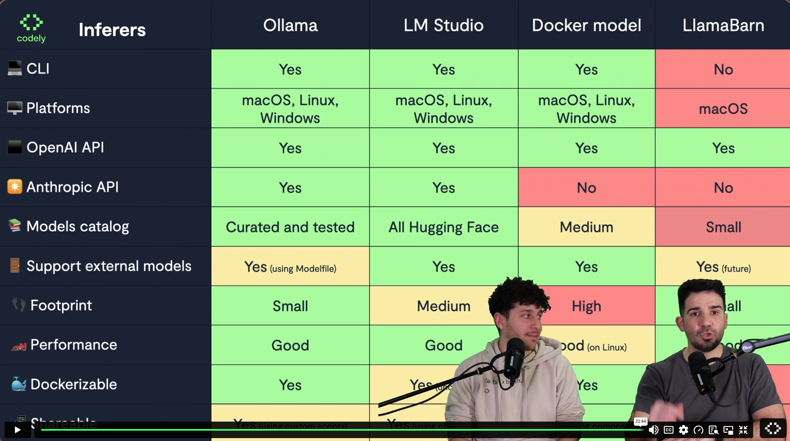
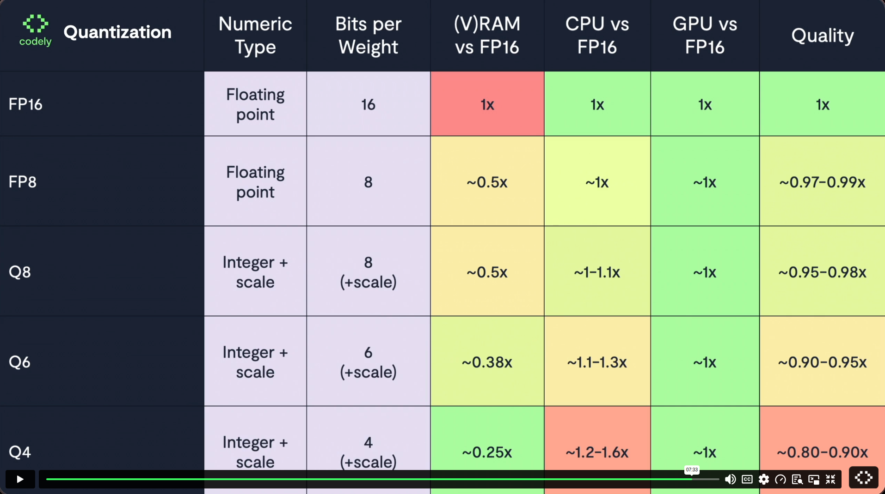

<!-- START doctoc generated TOC please keep comment here to allow auto update -->
<!-- DON'T EDIT THIS SECTION, INSTEAD RE-RUN doctoc TO UPDATE -->
**Table of Contents**  *generated with [DocToc](https://github.com/thlorenz/doctoc)*

- [IA en local: Privacidad y escalabilidad](#ia-en-local-privacidad-y-escalabilidad)
  - [🌼 Estrategia de modelos y arquitectura independiente del proveedor](#-estrategia-de-modelos-y-arquitectura-independiente-del-proveedor)
  - [🏗️ Caso práctico: Sugerencias y traducciones en local](#-caso-pr%C3%A1ctico-sugerencias-y-traducciones-en-local)
  - [🚀 Modelos locales en producción](#-modelos-locales-en-producci%C3%B3n)
  - [🔜 Conclusiones y siguientes pasos](#-conclusiones-y-siguientes-pasos)

<!-- END doctoc generated TOC please keep comment here to allow auto update -->

# IA en local: Privacidad y escalabilidad

- <https://pro.codely.com/library/ia-en-local-privacidad-y-escalabilidad-243087/752700/about/>
- ~95 min
- Creado en ¿febrero de 2026?

## Intro

- El inferidor más habitual: **llama.cpp**
  - <https://github.com/ggml-org/llama.cpp>
  - The main goal of llama.cpp is to enable LLM (and VLM) inference with minimal setup and state-of-the-art performance on a wide range of hardware - locally and in the cloud.
  - El inferidor llama al modelo (fichero con binario), por ejemplo:
    - GPT-OSS
    - Mistral AI
    - Gemma
- API / SDKs - Inferer+ / Server - Model
- Which to choose?
  - <https://github.com/CodelyTV/ai-local_models-course/tree/main/01-infer/2-which_to_choose>
  - Opciones
    - [Ollama](https://ollama.com/)
      - Created by ex-employees from Docker
      - Ollama is the most popular way to build with open models.
      - La API es compatible con ChatGPT y Anthropic (`ollama launch claude`).
      - Se podría enganchar Claude Code con tu servidor de Ollama
      - These models are much slower and less "intelligent"
      - [Lista de modelos en Ollama](https://ollama.com/search)
        - They are curated, you know they will work perfectly fine
    - [LM Studio](https://lmstudio.ai/)
      - Bionic
      - <https://lmstudio.ai/models>
        - All the Hugging Face models (HF es el GitHub de los modelos, el catálogo global)
        - They are not curated
        - <https://lmstudio.ai/models/mistralai/ministral-3-3b>
          - `lms get mistralai/ministral-3-3b`
          - The smallest model in the Ministral 3 family, combining a 3.4B language model with a 0.4B vision encoder for efficient edge deployment.
          - Supports context length of 256k tokens.
      - Principal competidor de Ollama
      - Nació como alternativa a ChatGPT, pero también admite usarlo como servidor local
    - **Docker Models**
      - <https://github.com/docker/model-runner>
        - Docker Model Runner (DMR) makes it easy to manage, run, and deploy AI models using Docker.
        - <https://github.com/docker/hello-genai>
          - Very simple GenAI application to try the Docker Model Runner
        - Designed for developers, Docker Model Runner streamlines the process of pulling, running, and serving large language models (LLMs) and other AI models directly from Docker Hub or any OCI-compliant registry.
      - <https://www.docker.com/products/model-runner/>
      - <https://docs.docker.com/ai/model-runner/>
      - [Introducing Docker Model Runner: A Better Way to Build and Run GenAI Models Locally](https://www.docker.com/blog/introducing-docker-model-runner/)
      - It accepts the same requests as the OpenAI API
      - [Define AI Models in Docker Compose applications](https://docs.docker.com/ai/compose/models-and-compose/)
      - `docker model install-runner --gpu cuda`
      - `docker model run ai/smollm2 "Say hello in one sentence."`
        - ai/smollm2 is about 360M parameters, so it downloads fast.
      - `docker model ls`
      - <https://hub.docker.com/u/ai> --> all the models

      ```bash
      docker model search                          # all models in Docker Hub's ai/ namespace
      docker model search qwen                     # filter by name or description
      docker model search --source=huggingface phi # search Hugging Face instead
      docker model search -n 50 gemma              # show more results (the default is 32)
      ```

      - **IMPORTANT**: in Mac, it does not work well, it is very slow
    - **LlamaBarn**
    - Only for Mac 🤷
    - <https://github.com/ggml-org/Llama-macOS>
    - <https://remotebrowser.substack.com/p/llamabarn-no-frills-local-llms-for>



## 🌼 Estrategia de modelos y arquitectura independiente del proveedor

- Criteria to follow when choosing a model
  - **Capabilities** (e.g. generate image, etc.)
  - **RAM** (HW consumption)
    - VRAM is the graphic display RAM
    - FromMacBook M1: RAM and VRAM are unified
  - **Context size** (e.g. for longer conversations)
- The RAM requirements can be calculated with the lower value between:
  - RAM (G) ≃ params * 1.2  (e.g. params = 8 billions)
  - RAM (G) ≃ size * 1.5    (e.g. size = 6 GB)
- <https://github.com/AlexsJones/llmfit>
  - To check if a model will run correctly in your system
  - [llmfit: One Command to Find What AI Models Run on Your Hardware](https://www.youtube.com/watch?v=JcCpJoVXXrg)
- FP: Floating Point
  - FP16 = 16 bits per weight (per parameter)
- Q: Quantization
  - Scale to reduce the capabilities of the model
  - Lobotomization


- **🎩 Cómo ser agnóstico del servidor de inferencia**
  - [AiSdkChatGateway](https://github.com/CodelyTV/ai-local_models-course/blob/main/02-models/2-inference/src/contexts/chat/infrastructure/AiSdkChatGateway.ts)
    - The model is injected... but this is **not recommended**, since each model needs different ways of using the prompt.
  - [OllamaAiSdkMinistral3ChatGateway](https://github.com/CodelyTV/ai-local_models-course/blob/main/02-models/2-inference/src/contexts/chat/infrastructure/OllamaAiSdkMinistral3ChatGateway.ts)
    - También descartada porque el códigno NO va a cambiar en base al servidor: da igual que lo infiera Ollama o LMStudio.
  - [AiSdkMinistral3ChatGateway](https://github.com/CodelyTV/ai-local_models-course/blob/main/02-models/2-inference/src/contexts/chat/infrastructure/AiSdkMinistral3ChatGateway.ts)
    - Nos quedamos con esto, porque el modelo sí influye

## 🏗️ Caso práctico: Sugerencias y traducciones en local

### 📢 Generar sugerencias en base a un texto

- Aplicación "Neveraly"
- [Código fuente en GitHub](https://github.com/CodelyTV/ai-local_models-course/tree/main/03-text_use_cases/1-text)
- [AiSdkMinistral3DishByIngredientsSuggesterGateway](https://github.com/CodelyTV/ai-local_models-course/blob/main/04-prod/1-ollama_ci/1-ci/src/contexts/dishes/dishes/infraestructure/AiSdkMinistral3DishByIngredientsSuggesterGateway.ts)
  - Usa la librería [AI SDK](https://ai-sdk.dev/)
    - A unified TypeScript SDK for building AI apps with modern streaming, fallbacks, and multi-model support
  - Define un esquema usando [`zod`](https://zod.dev/) con la respuesta esperada tras llamar al AI SDK

### 🪆 Generar embeddings utilizando un modelo específico

- [Código de ejemplo](https://github.com/CodelyTV/ai-local_models-course/tree/main/03-text_use_cases/2-embeddings)
- Cuando pedimos un plato, en la base de datos añade una nueva fila que contiene un campo `embedding`
- Embedding: vector multidimensional que representa semánticamente el contenido que queramos (por ejemplo la descripción y el título del plato en el caso de "Neveraly")
- El buscador de cursos de Codely ya es semántico (si buscas "spark" también muestra un curso con el emoji de estreallas 😅)
- [PostgresCookedDishRepository: storage of embedding](https://github.com/CodelyTV/ai-local_models-course/blob/d4608176042775a98469c833a5b4d956896912cf/03-text_use_cases/2-embeddings/src/contexts/dishes/cooked-dishes/infrastructure/PostgresCookedDishRepository.ts#L25)
- [Use of the embedding to exclude dishes when searching](https://github.com/CodelyTV/ai-local_models-course/blob/d4608176042775a98469c833a5b4d956896912cf/03-text_use_cases/2-embeddings/src/contexts/dishes/dishes/infraestructure/AiSdkMinistral3DishByIngredientsSuggesterGateway.ts#L41)
- [SQL statement using the embedding field](https://github.com/CodelyTV/ai-local_models-course/blob/d4608176042775a98469c833a5b4d956896912cf/03-text_use_cases/2-embeddings/src/contexts/dishes/cooked-dishes/infrastructure/PostgresCookedDishRepository.ts#L66)
- These examples use `pgvector` for PostgreSQL

### 🌐 Traducir nuestra aplicación con un modelo especializado

- Uso de <https://ollama.com/library/translategemma>
  - Específico para traducciones y para máquinas no muy potentes, por ejemplo para Android
- Los modelos `gemma` tienden a estasr pensados para ser ejecutados en máquinas no muy potentes
- [i18n of Neveraly](https://github.com/CodelyTV/ai-local_models-course/tree/d4608176042775a98469c833a5b4d956896912cf/03-text_use_cases/3-translation/src/app/i18n)
- `es.json` es generado a partir de `en.json` con el script [translate-i18n.ts](https://github.com/CodelyTV/ai-local_models-course/blob/d4608176042775a98469c833a5b4d956896912cf/03-text_use_cases/3-translation/src/app/scripts/translate-i18n.ts), el cual acaba llamando a `translategemma`
-

## 🚀 Modelos locales en producción

### 🐙 Ejecutar modelos local en CI

- <https://github.com/CodelyTV/ai-local_models-course/tree/main/04-prod/1-ollama_ci>
- Ejemplo de GitHub action: [ci.yml](https://github.com/CodelyTV/ai-local_models-course/blob/main/04-prod/1-ollama_ci/1-ci/.github/workflows/ci.yml)
- Even better: Dockerize, so that the same works for the CI pipeline and for local development
  - [compose.yml](https://github.com/CodelyTV/ai-local_models-course/blob/main/04-prod/1-ollama_ci/2-docker/compose.yml#L14)
  - I relies also on [ollama-entrypoint.sh](https://github.com/CodelyTV/ai-local_models-course/blob/main/04-prod/1-ollama_ci/2-docker/etc/ollama/ollama-entrypoint.sh)
    - Descarga los modelos con un retry básico, y arranca el servidor de ollama
  - Y en la pipeline también usamos [el mismo docker compose](https://github.com/CodelyTV/ai-local_models-course/blob/main/04-prod/1-ollama_ci/2-docker/.github/workflows/ci.yml#L31)

### 🛰️ Cómo Adevinta despliega modelos locales en producción

- [Joaquin Cabezas](https://www.linkedin.com/in/joaquincabezas/) y Jorge Castro - [video]](<https://pro.codely.com/library/ia-en-local-privacidad-y-escalabilidad-243087/752700/path/step/426449222/#block--Oll7xGqGgdjs3WV6_Ko>)
- Pasaron de CNN a Transformers: vieron que las pipelines y HW se les quedaban muy cortos.
- Querían usar modelos para generar embeddings para imágenes.
- Miles de peticiones por segundos, e.g. 6k req/s
- Requiere usar GPUs: usan Amazon, GPUs bajo demanda, no garantizada, sin instancias reservadas
  - No puedes dar por hecho que tienes los recursos si no tienes una instancia reservada
- Usan modelos ya conocidos, e.g. [OpenCLIP](https://github.com/mlfoundations/open_clip), pero no sabes cómo va a escalar en Producción
  - Requiere experimentar: e.g. EKS propio, con JMeter o [Locust](https://locust.io/) (open source load testing tool), haciendo muchas peticiones, con diversas iteraciones donde cambian algún parámetro.
- Para los desarrolladores:
  - Caso donde claramente salía mucho más caro montarlo tú, incluso en Amazon, que pagar Claude (por ejemplo). Sólo podría compensar para muchos millones de usuarios y muchos miles de peticiones por segundo.
  - Otra posible limitación son los `rate limits`.
- Desarrollan modelos propios en algunos casos, para determinados casos de uso donde no se puede resolver de manera mínimamente "óptima". Los suyos propios tienen más accuracy (pero hay un coste de oportunidad en juego, requiere meses de desarrollo y tuning).
- Han fine-tuneado algún modelo.
- Jorge: tira de API key, sería demasiado caro algo en local.
- **Stack**
  - PyTorch (antes TensorFlow), para experimentar con el modelo, con máquinas con GPU pedidas a Amazon (SageMaker)
  - [Amazon SageMaker](https://aws.amazon.com/es/sagemaker/)
    - Servicio orientado a la AI
  - Una vez el modelo está preparado, se pasa a la parte de inferencia
  - Inferencia:
    - [NVIDIA Triton](https://www.nvidia.com/en-us/ai/dynamo-triton/): es un servidor web en C, bastante complejo, que requiere una configuración muy específica. No es sencillo.
      - Run inference on trained machine learning or deep learning models from any framework on any processor
      - Deploy AI models on any major framework with Triton Inference Server—including TensorFlow, PyTorch, Python, ONNX, NVIDIA® TensorRT™, RAPIDS™ cuML, XGBoost, scikit-learn RandomForest, OpenVINO, custom C++, and more.
      - Entrenan y compilan algunos modelos en particular para los propios chips de Amazon ([Inferentia](https://aws.amazon.com/es/ai/machine-learning/inferentia/))
  - Una vez lo tienen, obien lo sirve con endpoint en SageMaker, o en su propio EKS.

## 🔜 Conclusiones y siguientes pasos

- TBD
