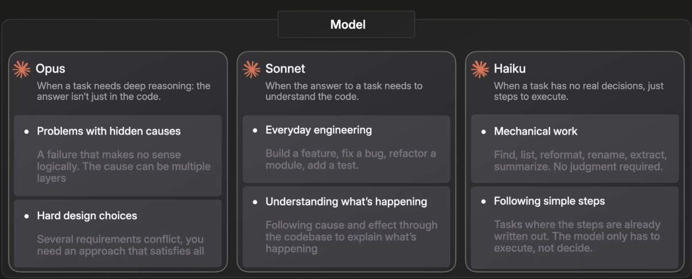
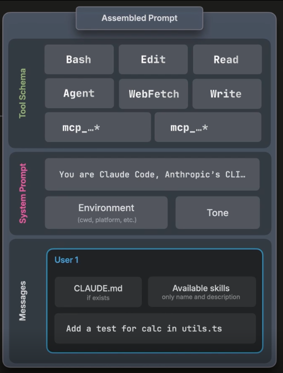
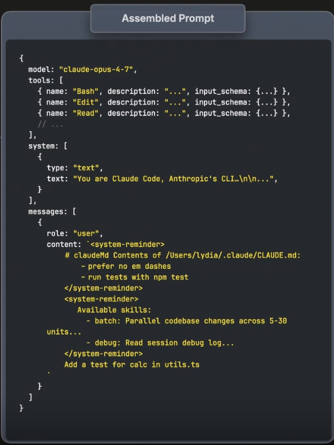
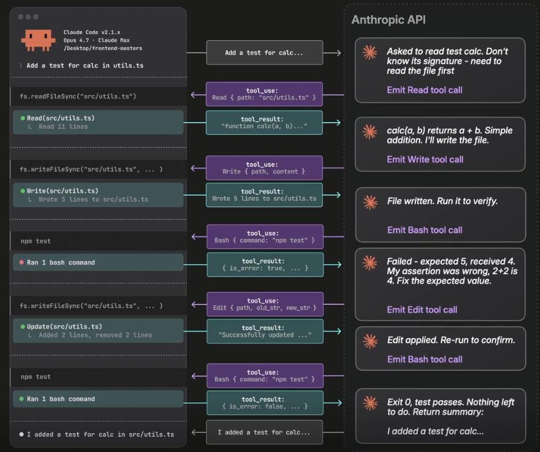
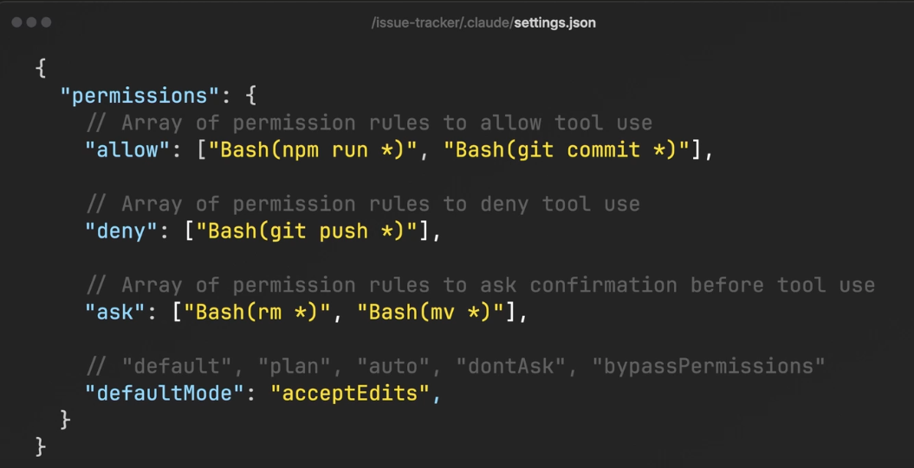
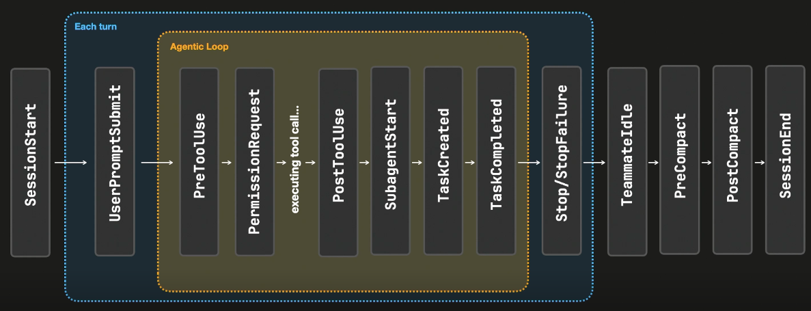
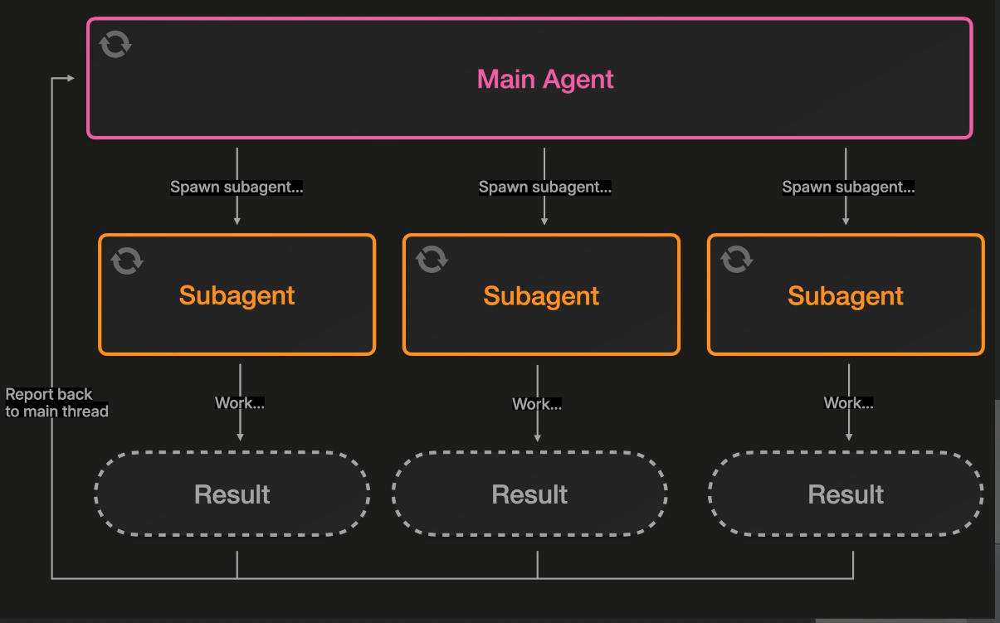
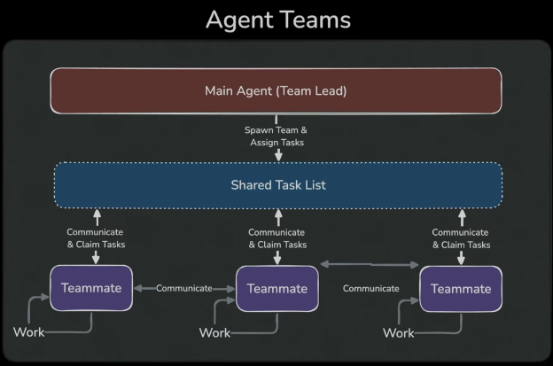
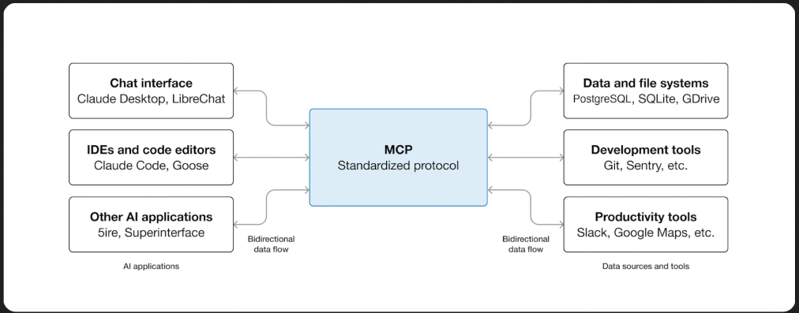

<!-- START doctoc generated TOC please keep comment here to allow auto update -->
<!-- DON'T EDIT THIS SECTION, INSTEAD RE-RUN doctoc TO UPDATE -->
**Table of Contents**  *generated with [DocToc](https://github.com/thlorenz/doctoc)*

- [Introduction to Claude Code (Frontend masters)](#introduction-to-claude-code-frontend-masters)
  - [Introduction](#introduction)
    - [Claude Code Under the Hood](#claude-code-under-the-hood)
  - [Permissions, Skills, & Hooks](#permissions-skills--hooks)
    - [CLAUDE.md & Plan mode](#claudemd--plan-mode)
    - [Permissions](#permissions)
    - [Effort & Context Windows](#effort--context-windows)
    - [Skills](#skills)
    - [Skill Creator](#skill-creator)
    - [Hooks](#hooks)
    - [Subagents](#subagents)
    - [Agent Teams](#agent-teams)
  - [Plugins & Claude Desktop](#plugins--claude-desktop)
    - [Plugins Overview](#plugins-overview)
    - [MCP Overview](#mcp-overview)
    - [Claude Code Desktop GitHub Workflow](#claude-code-desktop-github-workflow)
    - [Cowork](#cowork)
    - [Agent SDK](#agent-sdk)
  - [Other interesting commands](#other-interesting-commands)
  - [Ideas to implement/try](#ideas-to-implementtry)
  - [To share](#to-share)
  - [To read](#to-read)
  - [Questions](#questions)

<!-- END doctoc generated TOC please keep comment here to allow auto update -->

# Introduction to Claude Code (Frontend masters)

- Lydia Hallie
  - <https://www.linkedin.com/in/lydia-hallie/>
  - <https://www.youtube.com/@theavocoder>
- <https://master.dev/courses/claude-code/>
- <https://github.com/lydiahallie/demo-issue-tracker>
  - My fork: <https://github.com/islomar/demo-issue-tracker>
- Recorded in April 2026
- Duration: ~ 2 hours

## Introduction

### Claude Code Under the Hood

- Harness, models, and efforts.
- **Harness**
  - The program running Claude Code
  - It exposes all the the tools to the model, the shell commands, the code base, etc.
- **Models**
    
  - Trade-offs between capability, speed, and cost
  - Options
    - **Opus**
      - The most capable model.
      - Deep reasoning. The answer is not directly in the code
      - Opus on low effort level is like hiring an expert for 10 minutes.
    - **Sonnet**
      - General purpose task, good balance, preferred model for everyday SW engineering
      - Sonnet on high level is like hiring a beginner for like an hour
    - **Haiku**
      - Not great at reasoning.
      - Mechanical work
      - OK for simple tasks, like refactors.
    - **Fable**
  - The model can not do anything in your machine, it's the harness which does it.
  - The models can be used through an API: the one offered by Anthropic, but also AWS Bedrock, Vertex, etc.
  - The model is **stateless**
    - Every time we call the model, it starts from zero.
    - If you switch models mid-chat conversation, it will break cache (`prompt caching`): ideally you shouldn't switch model during a session
  - The harness provides **state**
- **Effort levels**: how hard you want the model to "think". Low, medium, high.
- `/fast` toggles fast mode — same model, faster output.

    - **Tool schemas** is every action can Claude Code can take on my behalf (JSON schema), so that the model know what it has available.
    - **System prompt** is hardcoded in Claude Code itself.
    - **Environment information
    - **Messages array**: User prompt, claude.md file, skill lists, etc.

- The **agentic loop** is the continuous back-and-forth process between the harness (Claude Code) and the API/model.

## Permissions, Skills, & Hooks

### CLAUDE.md & Plan mode

- <https://github.com/lydiahallie/demo-issue-tracker>
- The `CLAUDE.md` file provides context to the AI model about the project's structure, conventions, technologies used, commands, architecture, and data flow. It helps reduce the number of tool calls by giving the model upfront information about the codebase, preventing it from needing to make additional queries to understand basic project details.
- Demo using Claude Code v2.1.116 and Sonnet 4.6 with high effort
- `/init`
  - It will create a `CLAUDE.md` based on the existing codebase
  - She used Sonnet for this
  - Her generated `CLAUDE.md` was longer and more detailed than mine 🤔
- `/memory` to edit your `CLAUDE.md` inline
- `/context`
  - To see how is the context filled currently, percentage used, how, etc.
- Plan mode
  - You can just prompt it, no need to switch to the "plan mode".
  - Plan Mode essentially adds a instruction to the prompt telling the model not to code anything yet.
- `bun install`
- `bun run dev`
- To make it prettier, she used <https://claude.ai/design>, attaching a screenshot, and then asking:
  - `Make this beautiful dark mode, modern design kanban style`
  - Then, she took a screenshot of the new design, went back to `claude` and prompted:
    - `I want to implement this design, how would you do that? Don't code anything yet, plan first`
  - I created a project pointing to the code base, no need for screenshot:
    - <https://claude.ai/design/p/3a881a64-2470-4419-904d-c6d0d5768dd5?file=Issue+Board+%28dark%29.dc.html>

### Permissions

- In `.claude/settings.json` we can define specific permissions

- `/permissions`
  - You can see what you allow, deny, ask, etc. and configure from there
  - Hierarchy: managed settings > global > project > user
    - The higher in the hierarchy (more to the left), the higher the precedence
    - <https://code.claude.com/docs/en/server-managed-settings>
    - Centrally configure Claude Code for your organization through server-delivered settings, without requiring device management infrastructure.
- `/fewer-permission-prompts`
  - It analyzes your previous Claude Code sessions, identifies tool calls that you've frequently accepted, and automatically adds them to your permissions settings to reduce repetitive prompting.

### Effort & Context Windows

- `/advisor`
  - Let Claude consult a stronger model at key moments
  - <https://claude.com/blog/the-advisor-strategy>
- If the model says that it can not do something, sometimes it's related to the Effort level.
  - Trade off when using max: setting the effort level to max provides deeper reasoning but results in higher inference costs and more expensive usage. The model may also overthink simple tasks that don't require extensive reasoning.
- The thing that it affects the most the size of a context window is **resuming** an old conversation. The conversation is cached for some time, but if you resume it and it not cached, it costs tokens for you.
- Her experience: when it passes 300k-400k tokens, depending on the model, she just compacts it herself or clears it or starts a new session.
- The model does not read the entire conversation on every call because there's also  a prompt caching happening in the API.
  - The entire prefix of your prompt gets cached on the API layer.
  - Only the newly appended assistant message and the user message actually get read by the API at that point
- The standard context window is 200,000 tokens, but it can be extended up to 1 million tokens.

### Skills

- <https://code.claude.com/docs/en/skills>
- <https://www.skills.sh/>
- Skills are now commands
- Skills by default use the main context
  - If you configure `context: fork`, it will run a sub-agent
- You can pass arguments to a skill: `$ARGUMENTS` inside the skill
- You can [inject dynamic context](https://code.claude.com/docs/en/skills#inject-dynamic-context)
  - The !`<command>` syntax runs shell commands before the skill content is sent to Claude.
- You can set:
  - the `model`
  - `disable-model-invocation`: for not sending it to the model, only keeping it locally
    - <https://code.claude.com/docs/en/skills#control-who-invokes-a-skill>
    - Only you can invoke the skill. Use this for workflows with side effects or that you want to control timing, like /commit, /deploy, or /send-slack-message. You don’t want Claude deciding to deploy because your code looks ready.
  - `user-invocable: false`
    - With user-invocable: false, you can’t invoke the skill, but Claude still can. To keep Claude from invoking it through the Skill tool, set disable-model-invocation: true.
  - `allowed-tools: xxxx`
    - If you add it, it won't allow anything else
  - `hooks:`
- Some models are better than others invoking automatically the skills.
  - The important part is the description
  - `when_to_use`: additional context for when Claude should invoke the skill

### Skill Creator

- <https://github.com/anthropics/skills/tree/main/skills/skill-creator>
- `/skill-creator`
  - [Built-in into Claude Code](https://academy.claude.com/tutorials/how-to-create-a-skill-with-claude-through-conversation)
  - Example: "A very simple code reviewer skill"
- It runs evals in your skills to evaluate if they actually work  
- If you add a new skill, execute `/reload-plugins`
- [`/insights`](https://code.claude.com/docs/en/commands#all-commands)
  - Announced in February 2026
  - Generate an HTML report analyzing your recent sessions on this machine: which projects you work in, how you use Claude Code, where things go wrong, and features to try.
  - [Example](file:///home/islomar/.claude/usage-data/report-2026-09-16-113203.html)
  - Don't run `/insights` every day. The sweet spot:
    - Every 2-3 weeks for regular monitoring
    - After a milestone (feature completion, release)
    - After a friction period to identify root causes
  - <https://angelo-lima.fr/en/claude-code-insights-command/>
- `/powerup`
  - Discover Claude Code features through quick interactive lessons with animated demos
  - `/branch` forks the conversation to try two approaches
- [`claude plugin eval`](https://code.claude.com/docs/en/whats-new/2026-w37) runs your plugin against a suite of test cases, scores the results, and by default runs each case again without the plugin so you can see what it contributes.

### Hooks

- <https://code.claude.com/docs/en/hooks>
- `/hooks`
- In order to share hooks in your company: use **plugins** (it packages hooks, skills, and MCPs)

### Subagents

- <https://code.claude.com/docs/en/sub-agents>
- Delegate task-specific work to separate agents with their own context, tools, and permissions.
- Subagents run in isolated contexts
- The `/agents` wizard has been removed.
  - Ask Claude to create or update subagents for you (e.g. "create a code-reviewer subagent that ..."),
- Prompt: "Use subagents to search these 5 directories"
- You can also run `/branch`, to fork the conversation into a new agent, inheriting the conversation,
- Agents use lots of tokens (because they start from scratch, nothing cached, etc.)

### Agent Teams

- Subagents can communicate among them.
- "Use a team of 5 agents to..."
- Agent teams use a lot more tokens than sub-agents. For most use cases, a sub-agent would be sufficient and more efficient.
- The team lead agent can notice when teammates quit or are idle and manage them accordingly.

## Plugins & Claude Desktop

### Plugins Overview

- <https://code.claude.com/docs/en/plugins>
- Create custom plugins to extend Claude Code with skills, agents, hooks, and MCP servers across projects and teams.
  - Use `${CLAUDE_PLUGIN_ROOT}`
- `/plugin`
  - Discover, Installed, Marketplaces, Errors.
- <https://github.com/lydiahallie/demo-issue-tracker/tree/plugin-exercise>
  - Add starter plugin scaffold with provided typecheck-gate script
  - <https://github.com/lydiahallie/demo-issue-tracker/blob/plugin-exercise/EXERCISE.md>
- Solution for the previous exercise: <https://github.com/lydiahallie/demo-issue-tracker/tree/plugin-exercise-solution>  
  - <https://github.com/lydiahallie/demo-issue-tracker/blob/plugin-exercise-solution/SOLUTION.md>
  - <https://github.com/lydiahallie/demo-issue-tracker/tree/plugin-exercise-solution/plugin>

### MCP Overview

- Model Context Protocol
- https://modelcontextprotocol.io/docs/2026-07-28/getting-started/intro
- Standard interfaces for the AI tools.
- Model Context Protocol SDK
  - https://www.npmjs.com/package/@modelcontextprotocol/sdk
  - https://github.com/modelcontextprotocol/typescript-sdk
    - https://ts.sdk.modelcontextprotocol.io/v2/

### Claude Code Desktop GitHub Workflow

- From Claude Design, you can "Send to Claude Code Web" and implement the design.

### Cowork

- TBD

### Agent SDK

- TBD

## Other interesting commands

- `/autofix-pr`: Monitor and autofix any issues with the current PR.
- Run `/remote-control` to take this session with you and pick up right where you left off on any device. Open the Code tab in the Claude mobile app, or visit claude.ai/code in a browser. The session keeps running on this machine while your other devices act as a remote control.
- Run `/teleport` to move a session between here and the cloud — send this one up to keep it going after you close the lid, or pull a web session into this terminal with full history.

## Ideas to implement/try

- Permissions
- Use of `/advisor`, `/insights`, `/powerup`
- [Create skill `/summarize-changes`](https://code.claude.com/docs/en/skills)
- Create [`/pr-summary`](https://code.claude.com/docs/en/skills#inject-dynamic-context)
- Pre-commit that runs `npx doctoc`
- `claude plugin eval`
- `/memory`

## To share

- Inject dynamic context in a skill
- `/advisor`
- `/insights`
- `/powerup`

## To read

- <https://code.claude.com/docs/en/whats-new>
- <https://claude.com/blog/the-advisor-strategy>
- <https://code.claude.com/docs/en/server-managed-settings>
- <https://support.claude.com/en/articles/11647753-how-do-usage-and-length-limits-work>

## Questions

- What is the influence in the token consumption switching between efforts in a model?
