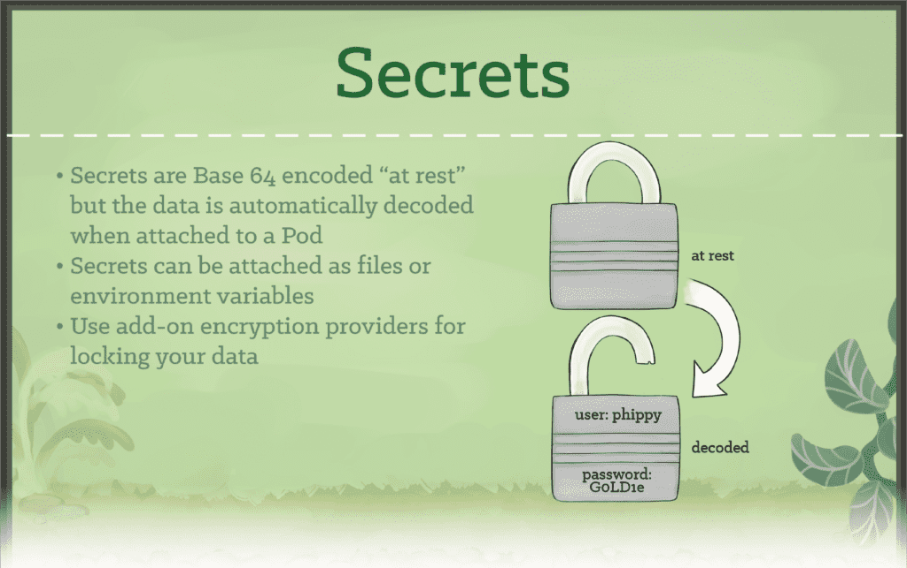

# CNCF Kubernetes stories
- https://www.cncf.io/phippy/

## General
- When you deploy Kubernetes, you get a **cluster**.
- A Kubernetes cluster consists of a set of worker machines, called **nodes**, that run containerized applications. Every cluster has at least one worker node.
- Kubernetes runs your workload by placing containers into Pods to run on Nodes. **A node may be a virtual or physical machine**, depending on the cluster.
- The worker node(s) host the Pods that are the components of the application workload. The **control plane** manages the worker nodes and the Pods in the cluster. In production environments, the control plane usually runs across multiple computers and a cluster usually runs multiple nodes, providing fault-tolerance and high availability.

## The Illustrated Children’s Guide to Kubernetes
- https://www.cncf.io/phippy/the-childrens-illustrated-guide-to-kubernetes/
- Kubernetes: Phi-Beta-Kappa: Philsophia Biou Kubernetes (Love of Wisdom Pilots life)
- "Kubernetes” is the Greek word for a ship’s captain.
- A **container** provides an isolated environment in which an app, together with its environment, can run. But those isolated containers often need to be managed and connected to the external world. Shared file systems, networking, scheduling, load balancing, and distribution are all challenges.
- Kubernetes uses **labels** as “nametags” to identify things. And it can query based on these labels. Labels are open-ended: You can use them to indicate roles, stability, or other important attributes.
- A **Pod** represents a runnable unit of work.
    - Usually, you will run a **single container** inside of a Pod. But for cases where a few containers are tightly coupled, you may opt to run more than one container inside of the same Pod.
    - Kubernetes takes on the work of connecting your pod to the **network** and the rest of the Kubernetes environment.

- **Replication controllers** provide a method for managing an arbitrary number of pods. A replication controller contains a **pod template**, which can be replicated any number of times. Through the replication controller, Kubernetes will manage your **pods’ lifecycle**, including scaling up and down, rolling deployments, and monitoring.

- A **service** tells the rest of the Kubernetes environment (including other pods and replication controllers) what services your application provides. While pods come and go, the service IP addresses and ports remain the same. And other applications can find your service through Kurbenetes service discovery.

- A **volume** represents a location where containers can access and store information. For the application, the volume appears as part of the local filesystem. But volumes may be backed by local storage, Ceph, Gluster, Elastic Block Storage, and a number of other storage backends.

- A **namespace** functions as a **grouping mechanism** inside of Kubernetes. Services, pods, replication controllers, and volumes can easily cooperate within a namespace, but the namespace **provides a degree of isolation** from the other parts of the cluster.

## Phippy Goes to the Zoo
- https://www.cncf.io/phippy/phippy-goes-to-the-zoo-book/

- In Kubernetes, Pods are responsible for running your containers. Every Pod holds at least one container, and controls the execution of that container. When the containers exit, the Pod dies too.

- A **ReplicaSet** ensures that a set of identically configured Pods are running at the desired replica count. If a Pod drops off, the ReplicaSet brings a new one online as a replacement.

    - ReplicaSets are considered a "low-level" type in k8s.
    - Often, k8s users opt for higher level abstractions like **Deployments** and **DaemonSets**

- **Secrets** are used to store non-public information, such as tokens, certificates, or passwords. Secrets can be attached to Pods at runtime so that sensitive configuration data can be stored securely in the cluster.

- A **Deployment** is a higher-order abstraction that controls deploying and maintaining a set of Pods. **Behind the scenes, it uses a ReplicaSet** to keep the Pods running, but it offers sophisticated logic for deploying, updating, and scaling a set of Pods within a cluster.

- **DaemonSets** provide a way to ensure that **a copy of a Pod is running on every node in the cluster**. As a cluster grows and shrinks, the DaemonSet spreads these specially labeled Pods across all of the nodes.

- **Ingresses** provide a way to declare that traffic ought to be channeled **from the outside of the cluster** into destination points within the cluster. One single external Ingress point can accept traffic destined to many different internal services.
    - Route traffic to and from the cluster

- **CronJobs** provide a method for scheduling the execution of Pods. They are excellent for running periodic tasks like backups, reports, and automated tests.

- **CustomResourceDefinitions**, or **CRDs**, provide an extension mechanism that cluster operators and developers can use to create their own resource types.

## Admiral Bash’s Island Adventure
- [PDF document (19 pages)](https://www.cncf.io/wp-content/uploads/2021/10/Admiral-Bash.pdf)
- [Video (40 minutes)](https://www.youtube.com/watch?v=dyA8rs5k6BQ)
- **Helm charts**: k8s templates for different resources. These templates mapped out exactly what was required for an application deployment.
- **Policies**
    - https://kubernetes.io/docs/concepts/policy/
    - Resource quotas
- Flux-bots. They really helped speed
up getting the applications into Kubernetes