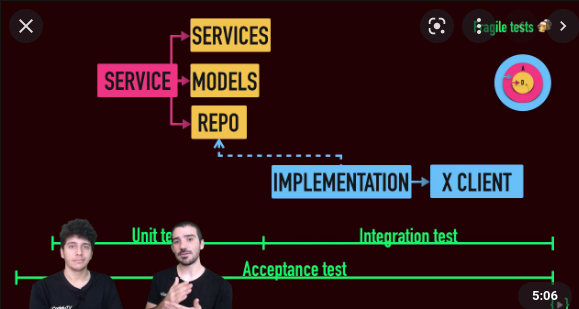

# Testing without mocks

- These are my notes after reading the article "Testing without mocks": https://www.jamesshore.com/v2/blog/2018/testing-without-mocks
- Post from 2018
- I don't see that the article is about "not using doubles" but "not using mocks" (though at the end they say they don't use doubles... which it is not true):
  - Nullable infrastructure is a double indeed, a "fake"!! (UsernameService.createNull)
  - They also mention the Stubs
  - En ocasiones creo que no tiene muy claro que los mocks no son el único tipo de dobles :-/
- Tampoco va de no crear ningún tipo de tests que llame realmente a la infraestsructura (ver "Focused Integration Tests", por ejemplo)
- They also talk about creating Stubs: "Embedded Stub"
- Mi sensación: no tiene en cuenta las posibilidades y beneficios de una **arquitectura hexagonal combinada con algo de DDD** y una estrategia de testing donde el "unit" sea sociable por defecto y el "integration" son los tests de los "secondary adapters".
- Logic patterns: **llevar ideas del mundo funcional** (separar "funciones puras" de funciones con I/O). Eso me parece bien.
- "Don’t do significant work in constructors. Don’t connect to external systems, start services, or perform long calculations. " --> **obvious in DDD, avoid the Active Record pattern**.
- **"Signature Shielding"** --> Object Mother + Builder pattern, nothing new
- They inject collaborators.
- **Collaborator-Based Isolation**: IMO the test shown there is a "bad practice" --> it repeates (couples) the SUT logic in the test ("renderAsOneLine()")
- **Logic Sandwich**: ¿cómo testea que realmente funciona la infraestructura? ¿Cómo testea que realmente se comunica con una DB que guarda y recupera correctamente X?
- "Now your application tests serve the same purpose as broad end-to-end tests:" --> WTF. Not at all... they are not testing the boundaries, si las llamadas a la infraestructura funcionan (pueden no funcionar por mil motivos diferentes: SQL mal escrita, credenciales erróneas, URI errónea, no tener permisos, etc.). Y es crítico.
- **Traffic Cop**: I didn't understand it.
- **Spy server**: too complex. Better "spy objects" or something like TetsContainers or LocalStack.
- **Focused Integration Tests**: al final sí testea la infraestructura... de hecho de la misma manera que lo hacemos nosotros :-)
- **Nullable Infrastructure**
  - Sobre "focused integration tests": "they’re overkill for code that depends on that infrastructure code."  --> highly disagree y además es la única manera de tener tests "realmente" fiables.
  - "Program each infrastructure class with a factory method, such as “createNull(),” that disables communication with the external system".  --> implica meter en producción código para testing. No mola.
- "Send Events" --> wow... that's definitely too complex (better to be avoided by default).
- "Conclusion: These patterns are an effective way of writing code that can be tested without test doubles, DI frameworks, or end-to-end tests."  -- >
  - but... that... is... not... true. For some parts, they use Fakes and Stubs :-/
  - and it uses "integration tests" (those which solely purpose is to interact with the infrastructure).

