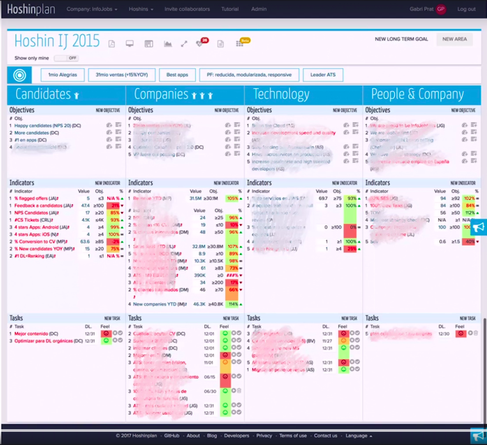

# Hoshin Planning: Estrategia Ágil con Hoshin Kanri y OKR's

- <https://www.udemy.com/course/estrategia-agil-con-hoshin-kanri-y-okr-s>
- (Grupo en LinkedIn](<https://www.linkedin.com/groups/13876191/>)
- Ángel Medinilla
- ETA: ~ 13 horas
- Como lograr la Agilidad empresarial, alinear a tus equipos y lograr tus objetivos con un marco Ágil estratégico
- <https://en.wikipedia.org/wiki/Hoshin_Kanri>
  - It is a 7-step process used in strategic planning in which strategic goals are communicated throughout the company and then put into action.
    1. Identificar las claves del negocio
    2. Establecer objetivos cuantificados de negocio
    3. Definir la visión global y las metas
    4. Desarrollar las estrategias para alcanzar las metas
    5. Determinar los planes de acción (tácticas y objetivos) para cada estrategia
    6. Establecer indicadores que midan el rendimiento de cada proceso
    7. Revisión
  - Also called "Policy Deployment": method for ensuring that the strategic goals of a company drive progress and action at every level within that company.
  - Translated from Japanese, Hoshin Kanri aptly means "compass management".
  - The individual words "hoshin" and "kanri" mean direction and administration, respectively.
- <https://leansisproductividad.com/que-es-el-hoshin-kanri-y-por-que-se-va-a-poner-tan-de-moda>
- <https://www.leanproduction.com/hoshin-kanri.html>
- <http://www.mcts.com/Hoshin-History.htm>
  - In 1965, Bridgestone Tire published a report analyzing the planning techniques used by Deming Prize winning companies. The techniques described were given the name Hoshin Kanri. By 1975, Hoshin was widely accepted in Japan.
- <http://mcts.com/Hoshin-Origins.htm>
- <https://www.researchgate.net/publication/303721323_Hoshin_Kanri_How_Toyota_Creates_a_Culture_of_Continuous_Improvement_to_Achieve_Lean_Goals>
- El poder de Hoshin kanri reside en el foco en los objetivos importantes.
- Foco en el flujo de valor, nada de "Hoshin para el departamento X"
- Priorización (6/7 items como máximo) y monitorización
- **¿Qué es Hoshin Planning?**
  Hoshin Planning se compone de dos enfoques principales:
  - En primer lugar, Hoshin Kanri, una marco metodológico creado por Toyota y que revolucionó la industria desde los años 90. La palabra japonesa Hoshin puede traducirse como «brújula»: el sistema funciona realmente como una brújula que marca el norte verdadero para toda la organización. La esencia de Hoshin Kanri es la comunicación entre todas las áreas y estamentos de la empresa para colaborar en la consecución de un mismo objetivo común.
  - El segundo pilar de Hoshin Planning son los OKR (Objetivos y Resultados Clave), una metodología desarrollada en Intel y posteriormente empleada por Google y otros gigantes tecnológicos. Los OKR definen objetivos estratégicos, y a diferencia de otras organizaciones que miden constantemente aspectos relacionados con costes, tiempos o alcances, los KR se centran en medir el impacto real en el cliente, los resultados logrados por los diferentes proyectos emprendidos en la búsqueda de los objetivos. En las palabras de su creador, John Doerr, se trata de «medir lo que realmente importa»

## Section 1: Introducción

- Normalmente sí hay una estrategia corporativa pero no ha llegado correctamente a todo el mundo (a nivel ejecutivo).
- Desalineamiento:
  - ejemplo del equipo de fútbol de Fred Kofman
    - <http://sinergia-christian.blogspot.com/2019/03/la-revolucion-del-sentido.html>
  - ejemplo de call-center y duración de las llamadas
- Objetivos (O) -> indicadores (KR) -> acciones.
- Visión + OKR + accionables. Top-down y bottom-up
- Dos puntos importantes:
  - Foco en resultados, impacto y cliente.
  - Frecuencia con la que trabajamos en el marco

## Section 2: Descripción general del marco Hoshin Planning

### Problemas a resolver

- Estrategia vs Operaciones
- Tiempo de decisión
- Adaptación
- Colaboración vs Silos
- Suboptimización
- Riesgo moral:
  - cuando individualmente se pone un objetivo con métrica y el bono depende de ello.
  - ejemplo del comienzo de call-center o fútbol.
- Visibilidad y claridad
- Enfoque en aprendizaje
- Responsabilidad (compartida)
  - "no entiendo por qué estamos trabajando en esto y no en esto otro"
- Priorización

### Hoshin Kanri

- Herramienta, modelo de pensamiento, marco de trabajo.
- Libro "Lean Thinking"
- Marco de decisiones estratégica. Foco en las iniciativas críticas para los objetivos de la empresa. Se seleccionan entre 3 y 5 objetivos y otros son claramente deseleccionados. Unifica y alinea los recursos y establece métricas claras que nos puede decir si estamos alcanzando los objetivos o no. Estas métricas se revisan de una manera frecuente.
- Hoshin: brújula, dirección.
- Kanri: acción.

### Cuadrante de Covey

- Stephen Covey.
- Cuadrantes de gestión del tiempo.
- Afilar el hacha.
- Eje y: "importante" vs "no importante"
- Eje x: "urgente" vs "no urgente"
- Ni urgente ni importante: eliminarlo
- Urgente y no importante: delegar
- Importante pero no urgente (cuadrante II): cuadrante de la mejora, se suele sacrificar por el I.
- Urgente e importante (cuadrante I): nos quedamos aquí.
- Piensa en algo que si lo empezaras hoy, sería un cambio importante en tu vida. Me recuerda al Horizon del Proyecto Unicornio. Suele ser el cuadrante II.
- Slack, holgura. Importane que las organizaciones del conocimiento tenga tiempo para pensar, cambiar, innovar, mejorar.

### Toyota Kata

- Metodología, libro "Toyota kata".
- Observaron que los managers/equipos repetían continuamente una conducta. Katas.
- Pasos de la Toyota Kata:
  1. Fijar un objetivo, una visión (estado futuro). Para qué hacemos lo que sea. Propósito.
  2. Saber dónde estamos ahora mismo, compararnos con ese objetivo futuro.
  3. ¿Cuál sería un incremento notable, la siguiente pequeña mejora?
  4. Pequeñas acciones para ese incremento, ¿qué métrica de progreso voy a usar?
- Muy parecido a **"Solution focus"** ("enfoque en solución": qué podemos hacer nosotros para mejorar)
  - <https://coachingleaders.co.uk/what-is-solution-focus/>
  - ¿Objetivo? ¿Dónde estás? (e.g. estoy en un 4 sobre 10 de X)
  - ¿Qué has hecho en el pasado para decir que están en un 4 y no en un 2?
  - No centrarse en lo que NO se hacía, sino en lo que SÍ hacía.
  - ¿Y qué pasará cuando consigas ese objetivo lejano?
  - Principles:
    - Focus on solutions not problems
    - People already have the resources they need to change
    - Change happens in small steps
    - Work at the surface level

### OKRs

- Empezó en Intel, de la mano de John Doerr. En Google lo popularizaron.
- Se centra en cuáles son los objetivos actuales y cuáles son las métricas de progreso.
- Cuando todo es prioritario, nada es prioritario.
- Cuidado con centrarse demasiado en un KR y "desbalancear" el sistema, es fácil que se pervierta.

### North Star

- La idea es tener una sola métrica que sea la que más importa de todas.
- Long term sustainable growth
- <https://www.forbes.com/sites/forbesagencycouncil/2017/07/19/how-to-find-your-companys-north-star-metric/>
- Normalmente muy basadas en un comportamiento de nuestro usuario, de nuestro cliente.
- Ejemplo de Booking.com
  - Objetivo: Nuestra estrategia es la retención de clientes.
  - Key Result:
    - % de usuarios que repiten
    - Tiempo de vida de usuarios
  - Accionable: renegociar contratos con proveedores para evitar overbooking.
  - Cliente que se quejaban de encontrarse con overbooking en el hotel y culpaban a Booking.com. Booking puso una política para que los hoteles se hicieran responsables de ello. Algunos hoteles rechazaron esa condición y simplemente redujeron su parque de hoteles.
  - Una vez consiguieron la retención, se centraron en volumen.

### Ejemplo concreto

- Visión: "ofrecer la misma experiencia que la tienda física, pero en casa"
- Estrategia: "ofrecer la mejor experiencia de usuario del mercado"
- Elegir entre 3 y 5 líneas estratégicas en total (no por áreas ni por departamentos).
  - Trabajar la oferta de producto
  - Trabajar la plataforma tecnológica: sencilla, entretenida, bonita.
  - Buena experiencia logística: que llegue rápido, devolución, etc.
    - rapidez
      - KR: tiempo promedio en entregar un paquete (con varianza baja).
    - comodidad
      - KR: xxx
  - Gran servicio de atención al cliente.
- Después, marcar objetivos por cada línea, e.g. para Atención al cliente:
  - Clientes satisfechos.
    - KR: NPS
    - KR: "coeficiente de viralidad".
  - Ser la número 1 en apps
    - KR: posicionamiento en la AppStore
    - KR: posicionamiento en el Android market
  - Alta calidad percibida
- Después faltan los accionables para los KRs.
- Tal vez tener un mix de objetivos más específicos y más difusos.

### Otro ejemplo: Agencia de Marketing

- Empresa que ha ido bajando en beneficios y rentabilidad.
- Proceso para analizar qué está pasando. Posibles líneas estratégicas:
  - Problema con los productos y servicios que ofrecen: se centraron en uno hace 2 años, se concentraron mucho ahí, pero hoy en día ese producot (que se llevó ese foco)
    - Tal vez actualizar el producto estrella.
    - Desarrollar nueva oferta de productos.
      - Lo que
  - Han perdido mercado
    - Recuperar LATAM: subir número de proyectos vendidos y subir un % los ingresos. Adwords, descuentos, etc.
    - Desarrollar Europa
  - Personas
    - problema de motivación del equipo. Herramientas tipo Happy Force (en un equipo pequeño no es necesario)
    - productividad

### Principios y valores

- Nada explícito en OKRs o Hoshin.
- Pactarlo en los equipos.
- Una propuesta de principios
  - Visión sistémica vs Objetivos parciales y suboptimización
    - Mirar los sistemas extremo a extremo.
    - No usar HK para optimizar una parte.
  - Aprendizaje y mejora vs Alcanzar cotas
    - Outcomes over outputs
    - No es una herramienta para medir a las personas, sino para aprender y mejorar, para mantenernos alineados y enfocados a lo que realmente aporta valor.
  - Colaboración y participación vs Órdenes y control
- Valores:
  - simplicidad: menos es más
  - honestidad: señalar lo que procede, "cortar" la política
  - transparencia: claridad organizacional y visibilidad
  - responsabilidad: apropiarnos del sistema, mantener nuestros compromisos >>> WTF!!!! RED FLAG!!!!
  - proactividad: aprendemos cuando hacemos. Evitar la parálisis por el análisis. La acción elimina el miedo.

### Diferencias con sistemas anteriores

- Cuadro de Mandos Integral, KPIs, etc.
- Cambios
  1. KRs frente a KPIs
     - KPIs son rendimiento, KRs son resultado. HP está orientado a resultados.
  2. No es "gestión por objetivos".
     - Outcomes vs outputs.
  3. Iteración constante frente a periodicidad anual
     - En todo momento entran y salen objetivos, KRs, accionables, etc.
     - Mínimo cada mes, dos meses, tres meses. Podría ser también semanal o quincenalmente.
  4. Co-creado, no jerárquico
     - Bueno... esto es un poco mentira, ¿no? ;-) Algunas partes sí, otras no...
  5. **NO ligado a bonos, incentivos, promociones, evaluaciones...**

### Vídeo de Dan Pink

- [Drive by Daniel Pink](https://www.youtube.com/watch?v=y8pzWmK4zhk)
- Mastery, autonomy and purpose

### El problema de los incentivos monetarios

- Historia de niños jugando al fútbol y dando balonazos a una puerta.
- Historia de hackaton con premios dados por el management.
- En el momento en el que se ponga un bono, la gente sólo va a ser eso... y se va a pervertir el funcionamiento del sistema.
- Ejemplo de WellsFargo: objetivo de dar muchos préstamos... los dieron a cascoporro, a gente con alto riesgo de no devolverlo.

### Hoshin personales: ¿sí o no?

- No lo recomienda, la idea es la globalidad.
- Si se relaja el "dial de exigencia", puede ser una herramienta tipo "plan de carrera"; en lugar de ser "igual para todo el mundo", que sirva para acompañar a cada individuo, con objetivos, retos, seguimiento, etc.
- No usarlo para evaluar el rendimiento.
- Los OKRs no deben llegar a las personas. No poner métricas a las personas.

### CFR's

- Conversation, Feedback, Recognition
- CFR's son las iniciales de "Conversaciones, Feedback, Reconocimiento". John Doerr los describe como "los hermanos de los OKR", y en cierto modo pensamos que su introducción en el marco de trabajo de OKR's obedece precisamente a los aspectos que hemos comentado en los videos anteriores sobre los OKR personales. Posiblemente, se trata de un esfuerzo para resaltar el papel de los OKR como marco para el aprendizaje y el desarrollo, no para establecer metas numéricas y realizar evaluaciones individuales de rendimiento. Esto, unido al caracter continuo de los OKR, nos lleva a que sea importante mantener conversaciones frecuentes con nuestro equipo acerca del propósito, la meta, la visión, la estrategia... Conforme vamos aprendiendo y vemos comportamientos que se desvían de nuestro norte verdadero,es el papel de líderes, facilitadores y también de los propios compañeros el proporcionar feedback y proponer nuevas acciones que nos devuelvan a nuestro rumbo. De igual forma, cuando los resultados nos dicen que estamos logrando nuestros objetivos, es importante otorgar reconocimiento y celebración del aprendizaje obtenido.
- De alguna forma, lo lógico en una organización que abraza el marco de trabajo Hoshin Planning es ir abandonando paulatinamente el concepto de evaluaciones de rendimiento anuales para sustituirlo por el **desarrollo y aprendizaje continuo**.

### El dial de exigencia

- Nivel 1: "hacer cosas"
- Nivel 2: "medir rendimiento"
  - Lo importante no es hacer lo que esté en el backlog.
- Nivel 3: "medir output"
- Nivel 4: "generar impactos"
- **Indicadores de bajo nivel de exigencia**: no llega a ser un KR estricto. Está bien tener alguno, pero cuidado...
  - Es un "indicador proxy"
  - A veces no se tiene la capacidad de medir algo directo con conseguir el objetivo.
  - "Indicadores de innovación tempranos"
- Ejemplo:
  - Objetivo: Queremos una ciudad saludable.
  - Nivel 1: "multar camiones"
    - Qué pasa si prefieren pagar las multas
  - Nivel 2: "árboles plantados".
    - Qué pasa si dispara las alergias
    - Qué pasa si después los queman y es peor
    - En realidad lo que buscamos no es "plantar árboles".
  - Nivel 3: "contaminación del aire"
  - Nivel 4: "ingresos hospitalarios"
    - El "ideal", pero mientras se logra ver resultados aquí, nos pueden ser útiles otros indicadores "menos exigentes".
- Otro ejemplo:
  - Nivel 1: tareas, sí/no
  - Nivel 2: KPIs
  - Nivel 3: porcentaje de progreso
  - Nivel 4: KR subjetivos vs objetivos

### ¿Dónde usar un Hoshin?

- Empezar siempre por el cliente.
- Propuesta de valor: ¿Cuál es el problema de cliente que mi empresa resuelve o quiere resolver "mejor que nadie"?
- No hacer un Hoshin por departamento.
- No perpetuar el comportamiento en silos. Problema de suboptimización.
- Podría tener sentido montar un Hoshin por producto, por servicio/flujo de valor, por customer journey, etc...
- **"Jobs to be done"**:
  - qué trabajos tenemos que hacer para el cliente.
  - entender qué necesita el cliente de mí
  - <https://jobs-to-be-done.com/jobs-to-be-done-a-framework-for-customer-needs-c883cbf61c90>
  - <https://hbr.org/2016/09/know-your-customers-jobs-to-be-done>
  - “Job” is shorthand for what an individual really seeks to accomplish in a given circumstance.
  - The circumstances are more important than customer characteristics, product attributes, new technologies, or trends.
  - Jobs are never simply about function—they have powerful social and emotional dimensions.
  - Good innovations solve problems that formerly had only inadequate solutions—or no solution.
- Hoshin de equipo para medirlos, fiscalizarles, ponerles número, etc.: NEIN!

### Hoshin subsidiarios o anidados

- Objetivo: ser la mejor empresa en la que trabajar con el mejor talento en el mercado (sic)
- KR's:
  - Índice de satisfacción de empleado
  - Ranking Best Places to Work
  - Indice 360 de talento
- Se pueden crear Hoshin en cascada
- Líneas estratégicas:
  - Desarrollo de talento
    - Promoción de talento interno
    - Captación de talento -> Mejorar condiciones laborales
    - Evaluación interna de expertos: ¿cuantos referentes del sector hay?
    - Participación en charlas y congresos
  - Satisfacción de empleados
    - Desarrollar una cultura de feedback
    - Proporcionar un entorno seguro
    - Mejorar condiciones laborales

#### Indicadores agregados o compuestos

- "Grosería": hacer la media de los N indicadores (no significa nada, WTF)
- La tendencia por trimestre puede decirnos más...
- Si algún indicador es más relevante, se pueden ponderar dándoles más peso de cara a la media.

## Section 3: Sobre el propósito y la visión

- Líneas borrosas entre propósito, misión y visión.
- Propósito de Improvement21: ayudar a las empresas a tomar consciencia.
- **Propósito**: quiénes somos y por qué somos eso. Cuál es la diferencia de nuestra empresa respecto a otras. Relacionado con nuestros valores, nuestra cultura, nuestros principios. **Para qué** hacemos el producto/servicio y cómo se enlaza con los valores.
- **Misión**: cómo lo vamos a hacer, qué vamos a construir. Lo que tenemos que hacer, lo que hemos venido a hacer. A veces describe el producto de la empresa.
  - Mission statements de las empresas.
- **Visión**: futuro. Cómo será el futuro una vez cumplamos con nuestras misión.
- Huir de definiciones SMART e INVEST.
- Buscamos que inspire.
- Debe ser memorable.
- El propósito tiene que estar conectado con la cultura y los valores de la empresa.
- Debe ser claramente entendible, fácil de recordar. Simple.
- Debe ser realista.
- Simon Sinek tiene una charla TED titulada "How Great Leaders Inspire Action" en la que habla del círculo dorado (WHY - HOW - WHAT), lo que ha hecho que el video muchas veces sea referido como "Start With WHY" - comienza con el por qué / para qué.

### Proyecto, Producto, Problema

- Las empresas suelen estar muy centradas en **"Proyectos"**, muy centradas en indicadores de rendimiento: tiempo para entregar el producto, recursos con los que se cuenta, funcionalidades a entregar, etc. Proyectos exitosos que no sirven para nada.
  - El Hoshin no debería ir orientado a un proyecto.
  - El proyecto puede apoyar a los OKRs, no al contrario
- **Producto**: Kodak. Se centró en el producto y se olvidó de sus usuarios, que estaban viendo ventajas en la fotografía digital.
- Espacio **"Problema"**: Customer-centricity. Sólo es valor aquello que repercute en el cliente (sic).

### Flujos de valor

- Identificar quiénes son los clientes de la empresa.
- El cliente nos da algo a cambio de resolverle el problema que sea.
- Definir los "touchpoints", dónde toco al cliente. Empezar el Value Stream Mapping por el cliente: ¿qué recibe? ¿cómo?, etc. Ir hacia atrás. Comenzar siempre con el cliente, con la entrega de valor.
- Reflexionar sobre a qué nos dedicamos en la empresa, cómo generamos valor, etc.
- **Business Model Canvas**
  - Key partners
  - Key activities
  - Key resources
  - Cost structure
  - Value proposition
  - Customer relationships
  - Channels
  - Revenue streams
  - Customer segments
- **Lean UX Canvas**
  - Business problem
  - Users & Customers
  - Hypotheses
  - Solution Ideas
  - What's the most important thing we need to learn first?
  - Business Outcomes
  - User Benefits
  - What's the least amount of work we need to do to learn the next most important thing?
- **Design Thinking**
  - **Empathy maps**:
    - Hear?
    - Think & Feel?
    - Say & Do?
    - See?
    - Pain
    - Gain
- The **Value Proposition Canvas**

### Conectando el ecosistema

- Clientes.
- Stockholders: quienes financian.
- Managers.
- Empleados (los separa de los managers, WTF)
- Proveedores.

## Section 4: Objetivos

- Los objetivos describen la estrategia de la compañía: éstas son las cosas importantes ahora mismo en la empresa.
- Los objetivos deberían responder a la pregunta "para qué".

### Reglas para Objetivos

- Más que reglas serían principios o recomendaciones
- Los objetivos deberían estar para dirigir el proceso de aprendizaje.
- No conectados a bonos, incentivos, promociones, evaluaciones de promociones, etc.
- Conectan con el propósito
- Describen la estrategia
- Responden a "Para qué"
- Definir entre 1 y 4 objetivos por cada área/iniciativa/producto/equipo/persona.
- Progresivos, no "binarios".
- Tienen un "dueño": no la persona responsable que deba responder de ello, sino una persona que por ejemplo haga seguimiento, un "sirviente" del objetivo.
- La mayoría debería ser emergentes o acordados: son los equipos de "primera línea" quienes los propongan a la "alta gestión".
- Revisados frecuentemente: e.g. cada dos meses o cada mes (según la incertidumbre)
- Ambiciosos, incluso "Moonshots": discrepo un poco
  - No asociados a bonus.
  - No asociados a premios/castigos.
  - La gente no debería sentirse presionada por ellos.
  - Cumplir entre un 60% y 80%.
  - Colar sólo algún moonshot.
  - Mantenerse en un "rango creativo" entre "demasiado fácil" y "estresante".
- Balanceados entre muy específicos y más abiertos

### 50 ejemplos de Objetivos - Objetivos de Compañía

- Hoshin no es una herramienta que cree una estrategia ni ofrezca directamente unos objetivos.
- "Aumentar ventas"
- "Mejorar rentabilidad"
- "Captar más mercado"
  - Definir el funnel, identificar dónde tenemos las principales pérdidas
- "Diversificar nuestra oferta"
- "Reforzar nuestro nicho"
- "Mejorar la calidad de nuestro producto"
- "Diferenciarnos de la competencia"

### 50 ejemplos de Objetivos - Objetivos de Marketing

- "Crear una newsletter mensual"
  - Es un objetivo de nivel de exigencia muy bajo. Falta preguntarse "el para qué". Es una acción binaria, no muy buen objetivo.
- "Mejorar engagement/recurrencia"
- "Mejorar la web"
- "Generar más leads"
- "Mejorar el proceso de adquisición"
- "Aumentar la conversión"
- "Implementar nuevo proceso de analíticas"
- "Entender mejor a nuestros clientes"
- "Ser la marca más reconocida"
- "#1 en lista BrandList antes del 31 de Diciembre"

### 50 ejemplos de Objetivos - Objetivos de CRM y RR.HH.

- "Automatizar el proceso de CRM"
  - Esto es "hacer cosas". Lo importante es "para qué".
- "Mejorar el seguimiento de clientes"
- "Respuestas más rápidas y de mejor calidad"
- "Clientes más satisfechos"
- "Mejorar el índice de satisfacción de clientes"
- "Índice de satisfacción 95% antes del 1 de junio"
  - Cerrado y prescriptivo.
- "Reducir la tasa de rotación"
- "Equilibrar nuestra oferta salarial"
- "La mejor empresa en la que trabajar"
  - Muy abierto. Tal vez más una misión o visión que un objetivo.
- "Contrataciones más rápidas"
- "Mejorar la motivación"
- "Desarrollar un plan de carrera / programa de mentoring / proceso de Onboarding"
  - Son cosas. Es un accionable, no un "para qué".
- "Mejorar la comunicación interna"
- "Liderazgo excepcional"
- "Mejorar la oferta formativa"
  - Peligroso.
- "Aumentar cursos ofrecidos en un 50%"
  - Peligroso: ¿la gente hace los cursos? ¿Cuál es el "para qué"?
- "Apreciación de los cursos es mayor del 95% en Q2": mejor que los dos anteriores (en realidad para un KR)

### 50 ejemplos de Objetivos - Objetivos de Operaciones, Equipos y Hoshin personales

- "Lanzar la nueva versión antes de mitad de año"
  - Es más bien un accionable.
- "Mejorar la disponibilidad del servicio"
- "Clientes más satisfechos / diferenciarnos de la competencia / merar calidad" - comunes con Marketing / Ventas
- "Reforzar alianzas con proveedores": MEH
- "Disminuir los fallos de la cadena de suministro"
- "Mejorar tiempos de entrega"
- Hoshin personales
  - "Leer 12 libros"
  - "Reducir mi estrés": mejor que el anterior
  - "Llamar a mi hijo al menos 3 veces por semana"
  - "Mejorar la relación con mi hijo"
  - "Reconectar socialmente"
  - "Mejorar mi salud física"
  - "Adquirir nuevas habilidades"
    - Mejor: "Mejorar mi empleabilidad"
  - "Balancear vida personal y profesional"

## Section 5: Resultados clave (KR's)

### KPI, Accionable, KR...

- Sacar un producto al mercado no es un KR. Se debe medir si el producto tiene el resultado que estamos esperando (facturación, ingresos, market share, satisfacción de usuarios, etc.).
- KPI: indicadores de rendimiento
- KR: indicadores de resultado
- Accionables: cosas que hacemos para ver si movemos la aguja de los KR.
- KR: cosas que hacemos para lograr el objetivo

### ¿Cómo determinar los KR para un objetivo?

- No hay una respuesta para todos los casos.
- Una manera es hacerse la **"pregunta milagro"**: anoche hubo un milagro y de repente hoy vemos que se cumplió el objetivo X; yo llego a la oficina sin saber nada... ¿cómo lo notaría, cómo me doy cuenta? (ejemplo de la felicidad de los empleados como objetivo, y que se notarían menos quejas o que nadie se iría de la empresa)
- ¿Cómo sé que nos estamos moviendo en la dirección correcta?
- ¿Cómo sé que NO estoy logrando el objetivo?
- ¿Cómo sabes que está ocurriendo algo que consideras "no deseable"?

### Reglas para KRs

- **Recordatorio objetivos**
  - Progresivos, revisados frecuentemente
  - 1/4 por área/iniciativa/equipo...
  - Tienen un dueño
  - Emergentes, acordados
  - Balanceados entre abiertos, cerrados, ambiciosos...
  - Dirigen el proceso de aprendizaje, no conectados a bonos
- Es bueno que los KRs sean:

  - Cuantitativos
  - Preferentemente "fehacientes" (evaluación objetiva)
  - Progresivos (0-100%)
  - 1 a 4 por cada objetivo
  - Actualizados frecuentemente
  - Influenciables por los interesados
  - No conectados a bonos / incentivos / evaluaciones de rendimiento / promociones...

### Ecosistema de métricas

- Aparece en libro "Workout"
- Define un propósito para la métrica
- Mide desde diferentes perspectivas
- Usar las métricas para mejorar
- Sirve a todos los implicados
- Desconfía de los números
- Establece umbrales imprecisos
- Sé propietario de tus métricas
  - Que tú puedas obtener la métrica directamente
  - Que yo pueda influenciar esa métrica
- No conectes métricas a recompensas
- Promueve valores y transparencia
- Visualiza y humaniza
- Mide a menudo y de forma temprana
- Experimenta

### Determinando umbrales

- Tiende a no poner umbrales muy fijos, sino a poner el foco en cuál es la aguja y ver si la movemos.
- A veces es mejor no poner umbrales: trabajar N meses haciéndolo lo mejor que podamos y ver...
- Podemos echar un vistazo al histórico, pero teniendo en cuenta que las condiciones son similares.

### KRs de control

- Preguntarnos: si quisiéramos engañarnos (aunque fuera sin querer) con respecto a este KR, ¿cómo lo haríamos? Poner KRs para evitarlo.

### KR's Proxy / Indicadores tempranos de innovación

- E.g.: quiero "reconocimiento de marca".
- Si tengo un objetivo a largo plazo y que va a tardar mucho tiempo en ocurrir, necesitamos métricas "intermedias" que nos den pistas de si voy por el buen camino o no.
- Bajamos el dial de exigencia.

### KRs compuestos

- Objetivo estratégico: "ser más ágiles" (sic)
- Cuadrante con:
  - Valor
  - Adaptación
  - Colaboración
  - Mejora continua

### Algunos ejemplos de KR's

- Posibles preguntas para determinar los KRs:
  - ¿Cómo sé que NO he logrado el objetivo?
  - ¿Cómo sé que lo estoy logrando?
  - ¿Cómo sé que ya lo he logrado?
- Objetivo: mejorar un producto
  - KR: incidencias
  - KR: devoluciones
  - KR: defectos
  - Accionable: desarrollar un protocolo de calidad
- Objetivo: producto más escalable
  - KR: capacidad del producto
  - KR: tiempo / coste de escalar
  - KR: caídas del sistema
  - Accionable: implementar sistema de validación X, migrar plataforma Y
- Objetivo: rentabilidad
  - KR: rentabilidad
  - Sub-KR: coste
  - Sub-KR: beneficio
  - Accionable: mejorar / aumentar sistema de ventas, nombrar responsables de negocio
- Objetivo: satisfacción de clientes
  - KR: retorno
  - KR: referencias
  - KR: churn
  - Accionable: cumplir las fechas del roadmap
- Objetivo: recuperar mercado LatAm
  - KR: leads LatAm
  - KR: % ventas LatAm
  - Accionable: llamadas realizadas / campaña de publicidad en Colombia

## Section 6: Accionables

- **Proyecto**: fecha de inicio, fecha de fin, alcance del proyecto. Cada cosa que hagamos para el proyecto es una tarea. Hay dependencias entre tareas. Suelen ser binarios: hechos o no. Pueden durar mucho tiempo.
- **Accionables abiertos vs cerrados**
- **Experimentos**

## Section 7: Proceso completo

- Se trata de que Hoshin sustituya una parte de lo que se está haciendo, no "algo más" que hacer aparte de todo lo demás.

### Visión general de un Hoshin plan

- [Hoshin plan tool](https://www.hoshinplan.com/)
- Ejemplo Hoshin InfoJobs 2015:
  - Alrededor de cuatro áreas: Candidatos, Empresas, Tecnología y Gente

### Roles en Hoshin planning

- No existen roles en Hoshin plan.
- "Facilitador de OKRs" (sic): sabe de OKRs
- "Líder de OKRs" (sic): sabe de negocio, estrategia, etc.

### Eventos o procesos en Hoshin planning

- No existen prescripciones al respecto.
- Si estamos empezando de cero, empezaremos a hacer iteraciones sobre:
  - Cuál es la visión y el propósito.
  - Cuáles son las líneas estratégicas a priorizar.
  - Objetivos a marcar.
  - KRs
  - Primeros accionables
- Hasta tener un primer prototipo de Hoshin plan con todo lo anterior.
- Mejor no tardar mucho en hacer esto.
- Especie de "Inception"
- Cada 2 semanas, reflexionar: Toyota Kata, Problema-Solución >> iteración
- Cada 2 meses, replanificar: revisión del Hoshin, ver cómo vamos, si sigue teniendo sentido, si se quiere cambiar algo, siguientes dos meses, etc. Un día entero >> "capítulo/bimestre/incremento de programa"

### Hoshin a escala

- Los eventos de revisión de "capítulos" deberían hacerse entre todos los equipos.
- "Big room planning": una o dos personas representando cada equipo

### Artefactos: Tablones visuales

- Tablón visual tipo el de la herramienta HoshinPlan.
- Tablón visual para accionables: tablón Kanban.
  - Pendiente
  - En curso
  - Terminado
- Cada accionable: a qué objetivo y KR corresponde. Incluír la hipótesis: qué esperamos que ocurra cuando este accionable se haya llevado a cabo.
- Lanes/carriles en el tablero Kanban con las líneas estratégicas.

### Equilibrando con el trabajo diario / Business As Usual (BAU)

- Usar un mismo tablero Kanban en los equipos para visualizar, en dos lanes diferentes, el BAU y los accionables Hoshin.

## Section 8: Ejemplos prácticos y entrevistas

### Ejemplo completo: Agencia de Marketing Digital

- Empresa que ha ido bajando en beneficios y rentabilidad.
- Visión: Ayudar a las empresas a llegar a sus clientes
- Objetivo: Rentabilidad
- Líneas estratégicas:
  1. Renovar producto estrella
  - O1: recuperar competitividad
    - KR1: Benchmrak
    - KR2: precio
    - KR3: rentabilidad
  - O2: satisfacción clientes
    - KR1: NPS
    - KR2: Referencias
    - KR3: Recurrencia
  2. Innovar
  - O1: diversificar ingresos
    - KR1: Ventas producto antiguos
    - KR2: ventas productos nuevos
    - KR3: % ventas productos nuevos
  3. Recuperar mercado
  - O1: presencia LatAm
    - KR1: Ventas LatAm
    - KR2: % Ventas LatAm
  - O2: presencia Europa
    - KR1: Ventas Europa
    - KR2: % Ventas Europa
  4. Re-enganchar al equipo
  - O1: motivados
    - KR1: Índice motivación
    - KR2: Quejas
    - KR3: Bajas
      KR4: Rotación
  - O2: productivos
    - KR1: Cumplimiento clientes
    - KR2: Retraso acumulado

### Entrevista: Gabriel Prat

- https://www.linkedin.com/in/gabriprat
- https://gabri.io/
- 1.300 personas en 8 paises
- 160 personas en su departamento de Producto+IT
- Los objetivos deberían ser puestos de manera colaborativa: ni top-down ni bottom-up.
- Eliminar objetivos individuales.
- "Poner la infraestructura para cuando se tenga la cultura" (ejemplo paso de cebra y OKRs)
- Para establecer los indicadores, partir de qué se necesita (el objetivo) e ir hacia atrás para ver qué necesitamos hacer.

### Entrevista: Johnny Ordoñez

- https://www.linkedin.com/in/johnnyordonez

### Entrevista: Alex Rios

- https://www.linkedin.com/in/arios/

## Section 9: Conclusiones

- "Mide lo que importa"
  - Resultado, impacto en lugar de rendimientos, esfuerzo y coste.
  - "Empieza con el porqué"
- El marco está pensado para ALINEAR
  - De poco sirve si cada departamento o equipo se pone a hacer su propio mini-Hoshin: suboptimizaciones.
- El objetivo es APRENDER.
  - Probamos cosas para ver qué funciona y qué no funciona.

## Dudas o comentarios

- El audio no es nítido a veces.
- Foco en outputs... no obviar los outcomes (e.g. aprendizaje)
- Solution focus: cuidado con caer en culpabilizar a quien en realidad no tiene potestad y solo responsabilidad.
- "Todo siempre en positivo". Hhhmm... cuidado.
- "Coach de OKR": WTF
- Valores -> responsabilidad: apropiarnos del sistema, mantener nuestros compromisos >>> WTF!!!! RED FLAG!!!!
- Ejemplo de Hoshin subsidiariso: talento, etc.
- Al cliente final le da igual todo lo que no le aporte valor, e.g. cuanto se paga a los trabajadores > WTF!!!!

## Q&A

- ¿Diferencias entre KPI y KR?
  - Es una duda habitual, y parte de la razón es que dependiendo de cuál es tu objetivo, la misma métrica podría resultar un KPI o un KR.
    > Por ejemplo: si decido que mi objetivo es reducir el tiempo de respuesta, entonces tiempo de respuesta es un KR. Pero si mi objetivo es mejorar la satisfacción del cliente o mejorar la calidad del producto, el tiempo de respuesta pasa a ser un KPI: me informa del rendimiento de mi trabajo, pero no me dice si estoy cerca del objetivo de satisfacción / calidad.
    > Tanto en KPI’s como en KR’s los habrá lagging y los habrá leading, ya que al final en ambos casos se trata de métricas. De nuevo, la diferencia está en definir cuál o cuáles de estas métricas son las que me definen si el objetivo se está cumpliendo y cuáles complementan a nivel de rendimiento.

## Otros links interesantes

- https://aktiasolutions.com/es/tres-grandes-herramientas-estrategicas
  - **Wardley maps**
    - Usa un mapa de Wardley para comprender el paisaje, la posición y el movimiento de todos los jugadores.
    - Wardley Maps es una herramienta de pensamiento estratégico, que no es lo mismo que una herramienta de planificación estratégica como los OKR o Hoshin Kanri.
    - ¿Dónde vamos y por qué?
    - ¿Cuál es nuestra situación actual?
    - ¿Cuáles son los principales desafíos en el camino?
    - ¿Dónde queremos jugar?
    - ¿Cómo planeamos ganar?
  - **Jobs to be done (JTBD)**
    - Utiliza JTBD para comprender realmente lo que los clientes intentan hacer e identificar los segmentos de mercado adecuados.
  - **Blue Ocean**
    - El Marco de las Cuatro Acciones
      - ¿Cuáles de los factores que la industria da por sentado deberían eliminarse?
      - ¿Qué factores deberían reducirse muy por debajo del estándar de la industria?
      - ¿Qué factores deberían elevarse muy por encima del estándar de la industria?
      - ¿Qué factores deben crearse que la industria nunca ha ofrecido?
