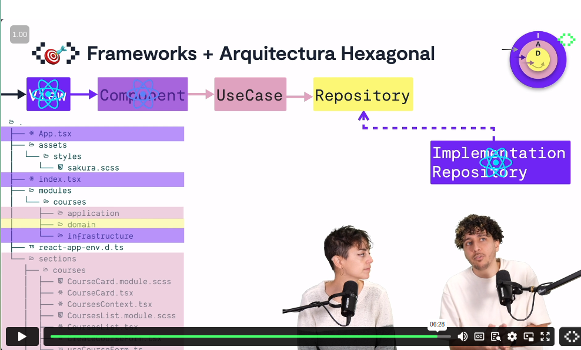

# Hexagonal Architecture in the Frontend
- Estimated durantion: 2 hours
- https://pro.codely.com/library/arquitectura-hexagonal-en-frontend-197663
- [Hexagonal Architecture in 10 minutes](https://github.com/CodelyTV/frontend-hexagonal_architecture-course/tree/main/01-hexagonal_architecture_in_frontend/1-hexagonal_architecture_in_10_minutes)
- [Code examples from the course](https://github.com/CodelyTV/frontend-hexagonal_architecture-course)

## Frameworks
- They consider React Components as part of the Application layer... mixed with Infrastructure layer.
- Instead of using a folder "ui", they
    - "modules": the core, totally decoupled from the framework... except the "infrastructure" folder, which would be implementation of the Repository.
    - "sections": the React Components
        - They consider it "Application" somehow... The reason? In testing, the React Components will be our entrypoint, which is something traditionally done with the Use Cases (Application).
