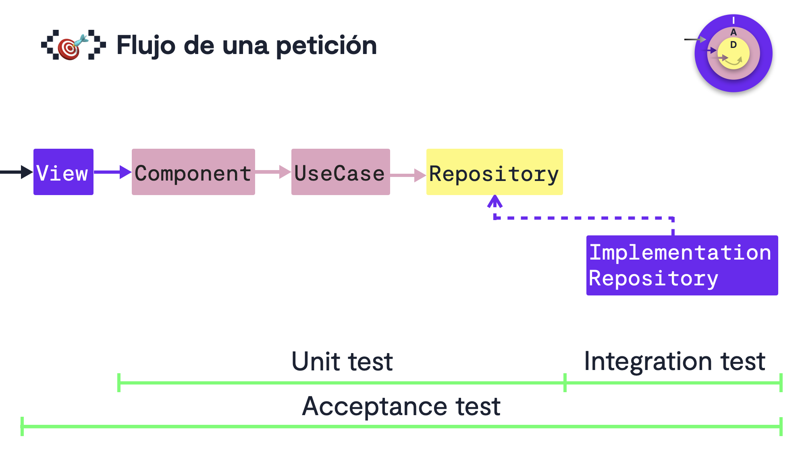

# Hexagonal Architecture in the Frontend
- Estimated durantion: 2 hours
- https://pro.codely.com/library/arquitectura-hexagonal-en-frontend-197663
- [Hexagonal Architecture in 10 minutes](https://github.com/CodelyTV/frontend-hexagonal_architecture-course/tree/main/01-hexagonal_architecture_in_frontend/1-hexagonal_architecture_in_10_minutes)
- [Code examples from the course](https://github.com/CodelyTV/frontend-hexagonal_architecture-course)

## Frameworks
- They consider React Components and Hooks as part of the Application layer... mixed with Infrastructure layer.
- Instead of using a folder "ui", they have:
    - "modules": the core, totally decoupled from the framework... except the "infrastructure" folder, which would be implementation of the Repository.
    - "sections": the React Components
        - They consider it "Application" somehow... The reason? In testing, the React Components will be our entrypoint, which is something traditionally done with the Use Cases (Application).

## Your first Use Case using Hexagonal Architecture
- [Code example in React for creating a course](https://github.com/CodelyTV/frontend-hexagonal_architecture-course/tree/main/02-first_use_case/1-create_course)
- Context: component where we can encapsulate info accessible from any children.
- Repository pattern:
    - [Example code with Repository pattern](https://github.com/CodelyTV/frontend-hexagonal_architecture-course/tree/main/02-first_use_case/2-repository_pattern)
- Validations
    - [Example code about validations](https://github.com/CodelyTV/frontend-hexagonal_architecture-course/tree/main/02-first_use_case/3-validations)
    - `ensureCourseIsValid`
    - Besides the validations in the useCase, we also include a `useEffect` in the Context, so that the user experience improves and we show error messages in case the data introduced by the user in a form doesn't respect the required 

## Testing strategy

- [Code example for unit testing using Jest](https://github.com/CodelyTV/frontend-hexagonal_architecture-course/tree/main/03-testing/2-unit-testing)
    - Unit test for the `CoursesContextProvider` injecting the Repository.
- [Integration and e2e tests](https://github.com/CodelyTV/frontend-hexagonal_architecture-course/tree/main/03-testing/3-integration-e2e)
    - They use Cypress both for the integration (secondary adapters) and the e2e tests.
    - Jest does not have `fetch`, that's why we use Cypress also for integration tests, so that we use `fetch` in a more realistic way, from a browser.

### Peligros de doblar el fetch

- https://github.com/CodelyTV/javascript-testing-frontend-course/tree/main/62-mocking-fetch
- Alternativa: usar el MSW (Mock Service Worker)
  - https://mswjs.io/
  - Se intercepta la llamada de red del fetch, no se dobla el fetch.
  - en el `setupTests.js` configuramos que se levante, resetee y pare el servidor de MSW.
  - Útil para fácilmente testear código legacy antes de empezar el refactor y crear Repositories. Es una primera capa de seguridad.

## My thoughts
- At high level, in React it looks like we can talk about "Views" and "Components".
- I guess Components are reusable and so it would be good to be able to differentiate them somehow (folder name? Suffix?)
- TBD