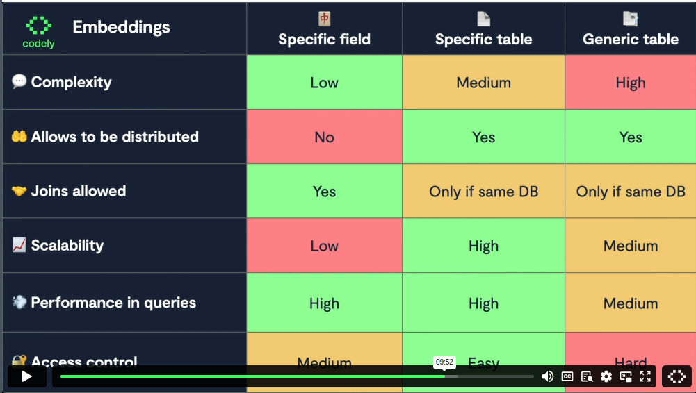
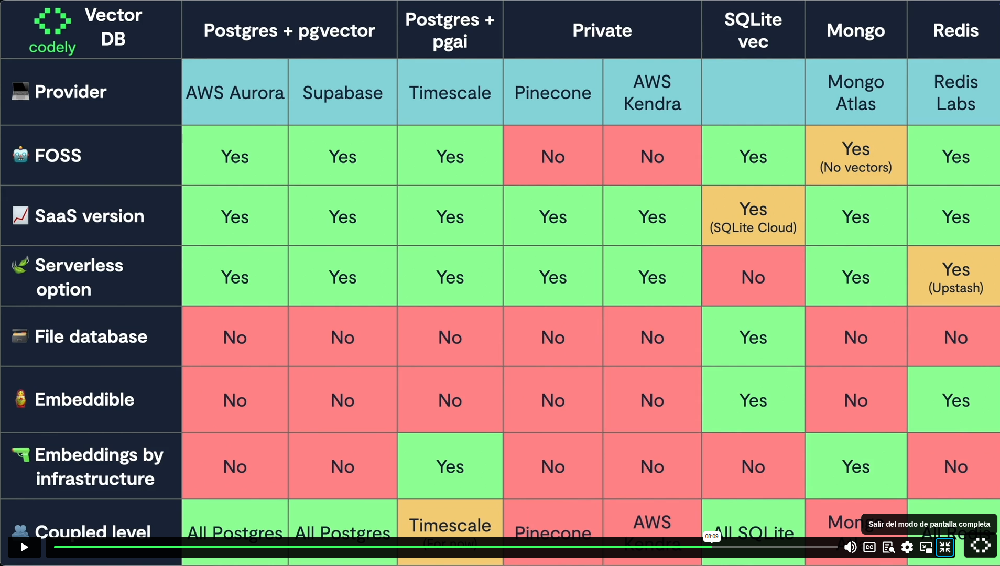

# IA: Embeddings y RAG

- <https://pro.codely.com/library/ia-embeddings-y-rag-230838/655241/path/>
- <https://github.com/CodelyTV/ai-search_engine_with_rag-course>
- Asesor: Ángel Delgado
- Duración: ~ 3 horas

## 🚀 ¿Qué es RAG y los embeddings?, ¿qué aprenderás en el curso?

- **RAG (Retrieval-Augmented Generation)**
- 3 big LLM problems
  - Hallucinations
  - Cut-off date (no saben nada anterior a cierta fecha)
  - Finite context
- 3 ways to **RAG** (mecanismos para filtrar el conocimiento que le paso al prompt y limitar el contexto)
  - `SELECT * FROM courses WHERE category = 'DDD'`
  - Full-text search
    - e.g. con ElasticSearch, todos los cursos que contienen la palabra "Intro"
  - Vector search
    - e.g. "lístame los cursos introductorios de arquitectura y diseño de software". No contiene la palabra "intro" necesariamente, e.g. el de "Clean Code".
    - Solución: búsqueda vectorial aka búsqueda semántica.
    - `SELECT * FROM courses ORDER BY (embedding <=> ${generateEmbedding("Intro a Arq. y diseño de software")}) LIMIT 10;`
- RAG is a technique that enhances the capabilities of LLMs by **integrating them with external knowledge sources** to provide more accurate, relevant, and up-to-date responses. 

### 🧮 Qué es una búsqueda semántica y qué son los embeddings

- Gato, gato negro, perro, perro negro
- Una dimensión (tipo de animal):           vector(1)
- Dos dimensiones (tipo de animal y color): vector(2)
  - E.g. El gato está en la [-1, 1], el gato negro en la [-1, -1]
- Un **embedding** es un vector de N dimensiones (N es del orden de cientos o miles).
  - Esas dimensiones, inicialmente, tenían connotaciones de significado concreto. A día de hoy no, son conceptos abstractos.
  - Potencia de 2
  - A más dimensiones, más lenta es la búsqueda
- Se mide la "cercanía" teniendo en cuenta el ángulo del vector desde lo que buscas a lo que existe (NO por distancia euclidiana)
- Existen **modelos de embeddings**: le pasas un texto y te lo pasa a un embedding, e.g. "perro muy negro"
- La **comparación** del embedding se haría en la propia base de datos, pero la **generación** puede ser en la DB o llamando a un LLM o...
- **Embedding models** (to generate the embedding/vector)
  - `nomic-embed-text` vector(768): te lo puedes montar en local con OLlamA, <https://ollama.com/library/nomic-embed-text>
  - `text-embedding-3-small` vector(1536): de OpenAI
  - `text-embedding-3-large` vector(3072): de OpenAI
- [Recomendación de Supabase](https://supabase.com/docs/guides/ai/vector-columns#create-a-table-to-store-vectors), recomienda vector(384)
  - Para el embedding usan el [modelo `gte-small`](https://huggingface.co/Supabase/gte-small): en la tabla aparecen las dimensiones.

### 🧑‍🏫 Implementa RAG básico con PgVector + Langchain: Búsqueda de cursos similares

- [Código de ejemplo: RAG con PgVector](https://github.com/CodelyTV/ai-search_engine_with_rag-course/tree/main/01-what_is_rag/3-implement_rag_pgvector)
- `pgvector` es la extensión de Postgres que permite hacer búsquedas vectoriales dentro de Postgres
  - NO se encarga de generar el embedding/vector, sino de calcular la distancia. Y también permite almacenar el vector.
- A tu tabla normal, e.g. `cursos`, se le añade un campo `embedding vector(768)`
- En este ejemplo, sólo usa el nombre del curso para generar el embedding (usando OllamaEmbeddings, ofrecido por LangChain)
  - Tenemos que pasar el embedding a JSon antes de guardarlo en la tabla.
- De momento, una búsqueda por "Introducción a DDD" no está fina.

## 🔤 Embeddings: Búsqueda de curso por significado

### 🐳 Las diferentes formas de añadir embeddings

- En algunos tutoriales se propone tener una tabla con todos los embeddings, no tenerlos en las propias tablas de negocios.
  - Pero es más sencillo empezar por añadir el campo `embedding` a la tabla
- Las diferentes formas de añadir embeddings
  - **Specific field**
    - A la tabla `courses` le añado un campo `embedding`
  - **Specific table**
    - Tengo una tabla`course_embeddings` (desnormalización)
    - Probablemente la mejor.
  - **Generic table** (con todos los embeddings dentro)
    - Tengo una tabla genérica `embeddings`
    - IMO demasiada abstracción, demasiada generalización



### 📤 Contexto: Cómo es una aplicación EDA con sugerencias LLM

- Overview del curso "Integra IA siguiendo buenas prácticas"

### ➕ Añade RAG a una aplicación EDA existente

- [Code example: add RAG existing embedding](https://github.com/CodelyTV/ai-search_engine_with_rag-course/tree/main/02-embedding/3-add_rag_existing_application)
  - The first execution failed because we were sending too much context. We can solve it using RAG.
- With RAG we limit the courses for which we want to generate recommendations
  - [We would ask for "similar" user courses, not all the user courses](https://github.com/CodelyTV/ai-search_engine_with_rag-course/blob/c966d5ac6c5d21d6eafbc7932a36a7ec3fcf61b4/02-embedding/3-add_rag_existing_application/src/contexts/mooc/user-course-suggestions/infrastructure/OllamaLlama31CourseSuggestionsGenerator.ts#L34-L34)
  - [`searchSimilar()`](https://github.com/CodelyTV/ai-search_engine_with_rag-course/blob/c966d5ac6c5d21d6eafbc7932a36a7ec3fcf61b4/02-embedding/3-add_rag_existing_application/src/contexts/mooc/courses/infrastructure/PostgresCourseRepository.ts#L75-L75)

```javascript
const availableCourses = await this.courseRepository.searchAll();
// const availableCourses = await
// this.courseRepository.searchSimilar(completedCourseIds);
```

- No hay determinismo, podría fallar: implementar por ejemplo _retries_

## 👨‍💻 Optimiza tu RAG añadiendo más contexto

### 🛖 Qué valores guardar como embedding

- [Ejemplo de código: qué guardar en el embedding](https://github.com/CodelyTV/ai-search_engine_with_rag-course/tree/main/03-add_rag/1-what_to_store_embedding)
- A la hora de crear el embedding, [añadimos más información](https://github.com/CodelyTV/ai-search_engine_with_rag-course/blob/c966d5ac6c5d21d6eafbc7932a36a7ec3fcf61b4/03-add_rag/1-what_to_store_embedding/src/app/scripts/search-courses-by-ids.ts#L30-L30): guardar no únicamente el nombre del curso, sino también un resumen y las categorías. De esa manera, obtengo una información más precisa.
- [LangSmith](https://www.langchain.com/langsmith): observabilidad existente en LangChain
  - LangSmith is a unified observability & evals platform where teams can debug, test, and monitor AI app performance — whether building with LangChain or not.

### 🗣️ Añade más contexto en los embeddings: Búsquedas granulares

- [Código de ejemplo: cómo añadir más contexto en los embeddings](https://github.com/CodelyTV/ai-search_engine_with_rag-course/tree/main/03-add_rag/2-add_embedding_context)
- Para el embedding, [añadimos el ID, nombre, summary y categorías](https://github.com/CodelyTV/ai-search_engine_with_rag-course/blob/c966d5ac6c5d21d6eafbc7932a36a7ec3fcf61b4/03-add_rag/2-add_embedding_context/src/contexts/mooc/user-course-suggestions/infrastructure/OllamaLlama31CourseSuggestionsGenerator.ts#L108-L108), en formato `yaml` (porque cuantos menos caracteres metamos para el embedding, mejor, si no se creerá que importan - mejor no usar json o XML para esto)

### ⏳ Ordena los resultados de una búsqueda por embeddings

- Interesa hacerlo por ejemplo si queremos los N cursos similares más recientes, por orden.
- [Código de ejemplo: ordenación RAG más reciente](https://github.com/CodelyTV/ai-search_engine_with_rag-course/tree/main/03-add_rag/3-rag_sort_by_recent)
- [En la SQL, ordenamos por la combinación del embedding y la recencia (con un peso, 0.001, por prueba y error, se puede empezar por 0.1)](https://github.com/CodelyTV/ai-search_engine_with_rag-course/blob/c966d5ac6c5d21d6eafbc7932a36a7ec3fcf61b4/03-add_rag/3-rag_sort_by_recent/src/contexts/mooc/courses/infrastructure/PostgresCourseRepository.ts#L86-L86)

## 🔥 Qué base de datos elegir para hacer búsqueda por embeddings

### ⛓️ Cómo delegar a infraestructura la generación de embeddings

- [Código de ejemplo de pgai](https://github.com/CodelyTV/ai-search_engine_with_rag-course/tree/main/04-what_db_to_choose/1-pgai)
- Cómo delegar la lógica de la evolución de los embeddings.
- Uso de [pgai Vectorizer](https://github.com/timescale/pgai): Power your RAG and Agentic applications with PostgreSQL
  - No es lo mismo que pgvector. `pgai` es una capa por encima de pgvector. Es otra extensión que [se tiene que habilitar](https://github.com/CodelyTV/ai-search_engine_with_rag-course/blob/c966d5ac6c5d21d6eafbc7932a36a7ec3fcf61b4/04-what_db_to_choose/1-pgai/1-simple_example/databases/0-enable-pgai.sql#L1-L1)
  - [Docker container con postgres_pgai](https://github.com/CodelyTV/ai-search_engine_with_rag-course/blob/c966d5ac6c5d21d6eafbc7932a36a7ec3fcf61b4/04-what_db_to_choose/1-pgai/1-simple_example/compose.yml#L3-L3)
- Vamos a generar los embeddings automáticamente: cada vez que se haga un insert, se genera su embedding.
  - Nos apoyamos en el [pgai-vectorizer_worker](https://github.com/CodelyTV/ai-search_engine_with_rag-course/blob/c966d5ac6c5d21d6eafbc7932a36a7ec3fcf61b4/04-what_db_to_choose/1-pgai/1-simple_example/compose.yml#L15-L15)
    - Cada 5 segundos mira si hay algo que actualizar. En Producción no sería así: hay un Kafka de por medio y se enchufan a un stream de datos.
    - El worker necesita algo para generar los embeddings. En este ejemplo, con Ollama.
  - Es necesario [configurar a `ai` cómo se deben generar los embeddings](https://github.com/CodelyTV/ai-search_engine_with_rag-course/blob/c966d5ac6c5d21d6eafbc7932a36a7ec3fcf61b4/04-what_db_to_choose/1-pgai/1-simple_example/databases/2-add_vectorizer_to_courses.sql#L1-L1)
    - Configuramos que el campo importante es `summary`
  - Tabla `courses_embedding_store`: la crea pg ai y no la tocamos directamente.
    - Lo que sí usaremos será la vista `courses_embedding` que se ha creado también automáticamente
- Creamos el embedding de la query [durante el SELECT](https://github.com/CodelyTV/ai-search_engine_with_rag-course/blob/c966d5ac6c5d21d6eafbc7932a36a7ec3fcf61b4/04-what_db_to_choose/1-pgai/1-simple_example/src/app/scripts/search-courses.ts#L15-L15)
  - Te quitas dependencias

### 🥊 Qué base de datos vectorial elegir: AWS vs Pinecone vs Postgres vs Supabase vs Timescale vs Redis

- pgai no depende de Timescale. Es decir, podríamos usar pgai en cualquier base de datos Postgres.
- Postgres + pgvector (e.g. AWS Aurora, Supabase) VS Postgres + pgai (e.g. Timescale) VS Private (Pinecone, AWS Kendra) VS SqLite vec VS Mongo (Mongo Atlas) VS Redis (Redis Labs)
- Opinión de opción más sensata: **Postgres + pgvector**
  - Para embebidos: SQLite vec



### 🐦‍🔥 Cómo añadir RAG utilizando una base de datos sin soporte nativo a tipos vectoriales

- [Código de ejemplo: combine databases](https://github.com/CodelyTV/ai-search_engine_with_rag-course/tree/main/04-what_db_to_choose/3-combine_databases)
- E.g. si usas MySQL. Podríamos almacenar los embeddings pero NO hacer la búsqueda por distancia vectorial
- "Solución": [guardar en Postgres únicamente los embeddings](https://github.com/CodelyTV/ai-search_engine_with_rag-course/blob/c966d5ac6c5d21d6eafbc7932a36a7ec3fcf61b4/04-what_db_to_choose/3-combine_databases/src/contexts/mooc/courses/infrastructure/MySqlCourseRepository.ts#L55-L55)

## 🍽️ Ingesta en base de datos vectorial datos de terceros
- Veremos
  - Ingesta de PDFs
  - Ingesta de PDFs con la API declarativa
  - Scraping web

### 📄 Ingesta PDFs a tu IA para hacer RAG con LanchChain

- [Ejemplo de código: importa PDFs con LangChain](https://github.com/CodelyTV/ai-search_engine_with_rag-course/tree/main/05-3r_party_data/1-pdfs)
  - Versión **imperativa** con la librería de LangChain.
  - Usa pgvector, no pgai
  - http://localhost:3012/
  - Importamos PDFs de un directorio (usando LangChain), generamos `documents` y a partir de ellos los embeddings y los almacenamos en un [vectorStore](https://github.com/CodelyTV/ai-search_engine_with_rag-course/blob/c966d5ac6c5d21d6eafbc7932a36a7ec3fcf61b4/05-3r_party_data/1-pdfs/src/app/scripts/scrape-posts.ts#L28-L28).
  - El embedding se genera a partir del [content](https://github.com/CodelyTV/ai-search_engine_with_rag-course/blob/c966d5ac6c5d21d6eafbc7932a36a7ec3fcf61b4/05-3r_party_data/1-pdfs/src/app/scripts/scrape-posts.ts#L45-L45)
- LangChain permite formas sencillas de escrapear documentas, generar embeddings, buscar embeddings, etc.
  - Como un SQL.
- Usamos [rlm/rag-prompt](https://smith.langchain.com/hub/rlm/rag-prompt): 
  - No tenemos que picar nuestra query de prompt, [esto nos proporciona el prompt](https://github.com/CodelyTV/ai-search_engine_with_rag-course/blob/c966d5ac6c5d21d6eafbc7932a36a7ec3fcf61b4/05-3r_party_data/1-pdfs/src/app/scripts/search-posts.ts#L23-L23)
    - El `context` que se le pasa es el texto del PDF que haya encontrado haciendo RAG. Esto hace RAG por debajo para saber qué pedazo me tiene que traer.
- `npm run scrape-posts`
- `npm run search-posts -- "En qué minuto se habla de dónde publicar eventos de dominio"`

### 🗣️ Importa PDFs con la API declarativa de LanchChain
- Versión **declarativa** con la librería de LangChain
- [Código de ejemplo](https://github.com/CodelyTV/ai-search_engine_with_rag-course/tree/main/05-3r_party_data/2-declarative_pdfs)
- Se simplifica, ya no es necesario dos llamadas diferentes. Por otra parte, el uso de `RunnablePassthrough()` hace que no haya que pasar la `query` dos veces como hacíamos en la primera versión imperativa.

### 🕸️ Scrapping web con Playwright y LangChain
- [Código de ejemplo: web scrapping](https://github.com/CodelyTV/ai-search_engine_with_rag-course/tree/main/05-3r_party_data/3-web_scrapping)
- Uso de LangChain: [webpages, with Playwright](https://js.langchain.com/docs/integrations/document_loaders/web_loaders/web_playwright/): how to parse data from webpages using Playwright. 
  - No está pensada para usarla recursivamente
  - No podemos usar `RecursiveUrlLoader` porque no interpreta JS a la hora de escrapear.
- Usamos el `chromium` de Playwright, no el de LangChain, porque este último no permite tener varias sesiones abiertas a la vez (paralelismo).  
- http://localhost:3012/
- Si en la tabla de DB intentas meter un UUID que no es válido, LangChain no peta y en su lugar te lo inserta creando un UUID: cuidado con eso para evitar insertar filas duplicadas.
- La respuesta tarda demasiado porque hay demasiado contexto. Troceando mejorará.

## 🍄 Mejora la búsqueda por embeddings con datos de terceros

### ✂️ Formas de cortar los datos para guardarlos de forma optimizada: Chunking
- 4 ways of chunking
  - **Length-based**
    - Character-based: cada N caracteres
    - Token-based
  - **Text-structured based**
    - Por párrafos: se puede limitar el tamaño de los párrafos
    - Paragraphs > sentences > words > chars
  - **Document-structed based**
  - **Semantic meaning based**

## 🔜 Conclusiones y siguientes pasos

- [ChatGPT Prompting vs RAG vs fine tuning: Aprovecha la IA al máximo | #laFunción 9x18](https://www.youtube.com/watch?v=bjCdsnkQ6Dw)
- Más cursos
  - [Embeddings automáticos en Postgres](https://pro.codely.com/library/embeddings-automaticos-en-postgres-236271/702554/about/)
