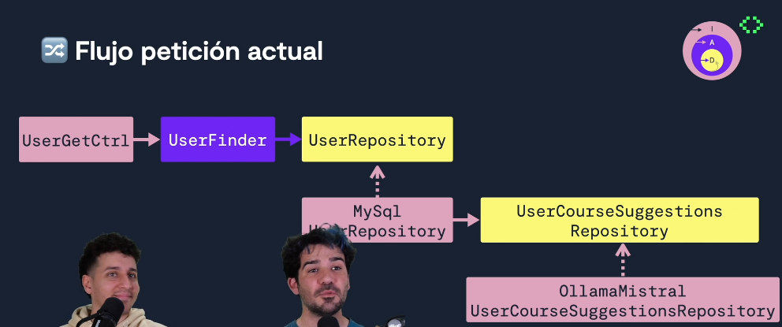
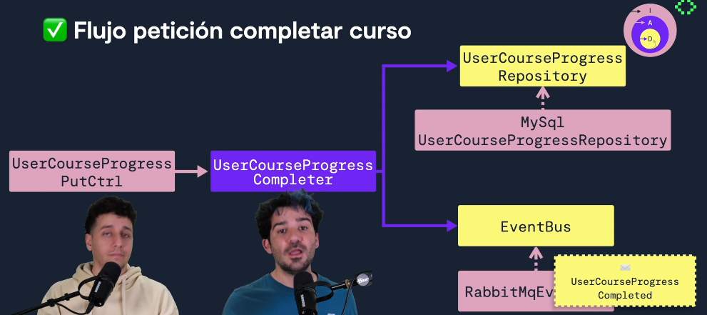
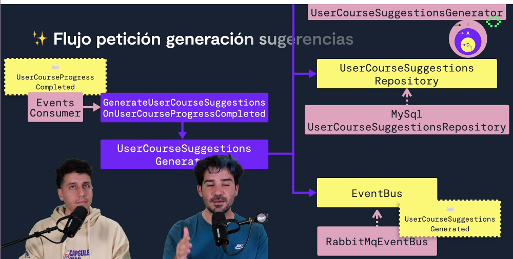
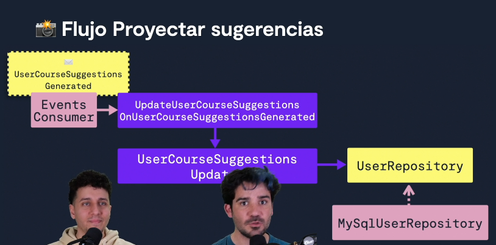
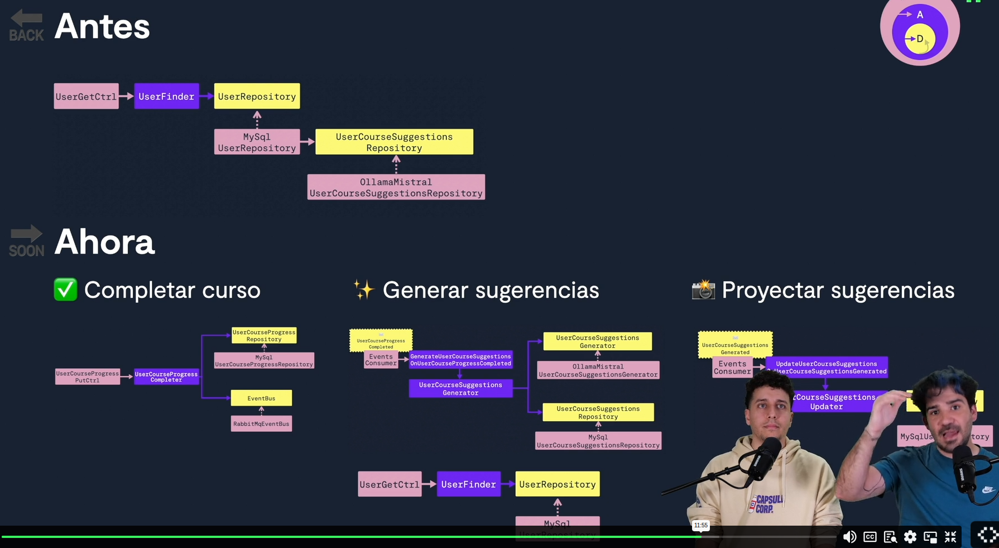

# Integra Inteligencia Artificial siguiendo buenas prácticas (OpenAI GPT, Ollama y LangChain)

## General

- <https://pro.codely.com/library/integra-inteligencia-artificial-siguiendo-buenas-practicas-openai-gpt-ollama-y-langchain-222393/598318/path/>
- <https://github.com/CodelyTV/add_ai_follwing_best_practices-course>
- Duración estimada: ~ 4 hours

## 🚀 ¿Cómo empezar con la Inteligencia Artificial como Developer?

- [ChatGPT Prompting vs RAG vs fine tuning: Aprovecha la IA al máximo](https://www.youtube.com/watch?v=bjCdsnkQ6Dw), video, 69 minutes
  - 13.02.2024
  - 3 ejemplos para diferenciar lo que podemos conseguir con prompt engineering, vs. RAG (Retrieval-Augmented Generation) vs. fine tuning de modelos de Inteligencia Artificial.
- [Cómo sacarle el máximo provecho a ChatGPT | #laFunción8x28](https://www.youtube.com/watch?v=sYZHBO3HRhA), video, 76 minutes
  - 25.04.2023
  - La IA es una herramienta muy poderosa que podemos utilizar en nuestro día a día. En el directo de hoy Bea Martín Valcárcel (@zigiella) nos ayudará a explorar diversas formas de darle utilidad.

### Conceptos de integración con IA

- **Modelos**
  - GPT (ChatGPT es la aplicación para el modelo GPT)
  - LLaMA, liberado por Meta, Open Source
  - Gemma (de Google, pesa poco, mejor para ordenadores no tan potentes)
  - Command R, open source, requieres mínimo 64 GB RAM local.
  - [Mistral](https://mistral.ai/)
  - Suno (audio)
  - Stable Diffusion (imágenes)
  - Lo que varía entre ellos es **cómo se interacciona con ellos**
- **Inferidor/servidor**
  - LLM server
  - Cómo se expone el modelo
  - [LlaMAcpp](https://github.com/ggml-org/llama.cpp) es el más conocido, genera un binario.
    - Sirve para varios modelos, no sólo para LLaMA.
  - Quiero desplegarlo, normalmente necesitas varios servidores. Muy caro en la nube.
  - **OLLaMa** es la más famosa abstracción sobre LLaMA hoy en día. Por debajo usa LLaMAcpp.
    - Ofrece un API HTTP
- **SDKs**
  - Abstracción que facilita la integración
  - **LangChain**: para JS y Python (ciudadano de primer nivel), el más famoso
    - **LangChain4j**: para JVM
    - Permitir aplicar técnicas de RAG, donde se complementa la información del modelo con tu propia "base de datos".
    - Puede interactuar con las APIs de OLLaMA y similar, pero también con los modelos directamente.
  - **Resonance**: para PHP
  - **XEF.ai**: para Kotlin
  - **ModelFusion**: para JS/TS, también recomendado por LLaMAcpp
  - [microsoft/semantic-kernel](https://github.com/microsoft/semantic-kernel): Integrate cutting-edge LLM technology quickly and easily into your apps
    - [Introducing new Ollama Connector for Local Models](https://devblogs.microsoft.com/semantic-kernel/introducing-new-ollama-connector-for-local-models/)

### Primeros pasos con OLLaMA

- [Código fuente](https://github.com/CodelyTV/add_ai_follwing_best_practices-course/tree/main/01-intro/2-ollama)
- <https://ollama.com/>
  - `brew install ollama`
  - `ollama serve`: también podrías tenerlo en segundo plano todo el tiempo, con `brew`
  - Descargar un modelo, e.g. `ollama pull gemma:latest`
    - Similar a Docker. Se puede dockerizar, pero en Mac no hay virtualización de la GPU e iría lentísimo.
  - `ollama run gemma:latest`, para arrancar el modelo.
  - ¿Qué modelo utilizar?
    - Prueba y error
    - Depende del tamaño de RAM que tengas
- Por defecto corre en el puerto 11434 (regla mnemotécnica: el número parece LLAMA)
  - See server status: `curl http://localhost:11434 -v`
  - List all the models downloaded: `curl http://localhost:11434/api/tags | jq`
  - Download a model: `curl --request POST http://localhost:11434/api/pull -d '{"model": "gemma:latest"}'`
    - Similar to `ollama pull gemma:latest`
  - Ask a model: `curl --request POST http://localhost:11434/api/generate --header "Content-Type: application/json" -d '{"model": "gemma:latest", "prompt": "Qué es CodelyTV? (en menos de 15 palabras)", "stream": false}' | jq`
    - El `stream: false` devuelve toda la respuesta de golpe, para evitar enviar poco a poco la respuesta (puede interesar o no, depende).
    - La respuesta incluye "context", que habría que volver a enviar si hiciéramos una nueva consulta relacionada con ésta, para que la considerase de la misma conversación.
      - El uso de SDKs facilita esto, no tienes que encargarte de ello a mano.

### Desmitifica apps con IA: LangChain vs ModelFusion

- [Código fuente](https://github.com/CodelyTV/add_ai_follwing_best_practices-course/tree/main/01-intro/3-integrate_model)
  - `curl http://localhost:3000/api/langchain?prompt=Que%20es%20CodelyTV`
  - `curl http://localhost:3000/api/modelfusion?prompt=Que%20es%20CodelyTV`
- Alternativas:
  - <https://js.langchain.com/docs/introduction/>
    - También existe para Python
    - LangChain is a framework for developing applications powered by large language models (LLMs).
  - <https://github.com/vercel/modelfusion>
- LangChain tiene mucha más comunidad...

## 💡 Arquitectura de software: Cómo encaja la IA en tu app

- **Caso de uso**: ofrecer sugerencias de cursos a un usuario que acaba de terminar un curso.
- [Código fuente](https://github.com/CodelyTV/add_ai_follwing_best_practices-course/tree/main/02-software_architecture/2-implementation_details)
- Onion Architecture:
  - Infrastructure
    - OllamaMistralUserCourseSuggestionsRepository
  - Application
  - Domain
    - UserCourseSuggestionsRepository

## 👤 Caso práctico: Perfil de usuario con sugerencias de cursos

- **Alternativa 1: Orquestado por caso de uso**
  - [Código fuente](https://github.com/CodelyTV/add_ai_follwing_best_practices-course/tree/main/03-user_profile_wth_suggestions/1-llm_use_case)
  - En el caso de uso "UserFinder" inyectamos un UserRepository y un CoursesSuggestionsRepository
  - No les convence porque tienen que actualizar el agregado User con las recomendaciones, a posteriori
- **Alternativa 2: Encapsulado en UsersRepository**
  - [Código fuente](https://github.com/CodelyTV/add_ai_follwing_best_practices-course/tree/main/03-user_profile_wth_suggestions/2-llm_in_repo)
  - Apuestan por esta opción
  - En el UserFinder inyectamos un UserRepository, quien a su vez tiene una dependencia/inyección del UserCourseSuggestionsRepository
  - En realidad deberíamos haber de un LoggedInUserRepository, ya que no querríamos ver los cursos recomendados para un usuario cuyo perfil estuviéramos visitando (y que también hubiera hecho una llamada al mismo Repository)

## ⌨️ Caso práctico: Prompting con Ollama

- [Código fuente](https://github.com/CodelyTV/add_ai_follwing_best_practices-course/tree/main/04-llm_implementation_details/1-implement_a_recommendator)
  - Hints para el prompt:
    - Usar "IMPORTANTE", le da importancia a las mayúsculas.
    - A veces necesitas repetir las instrucciones, tanto en positivo como en negativo.
    - Usar "system prompt" para aquello que deba mantenerse a lo largo de una conversación.
  - Ollama cachea por defecto si el prompt es el mismo.
- **Determinismo vía caché**
  - [Código fuente](https://github.com/CodelyTV/add_ai_follwing_best_practices-course/tree/main/04-llm_implementation_details/2-cache)  
  - Mejora en rendimiento y en el coste computacional.
  - La caché no es la solución ideal, pero ya es una mejora.
  - Esta caché en DB podría ser mejorada almacenándolo en un Redis con TTL o añadiendo un campo de timestamp para las recomendaciones.
  - Ejemplo de wrapper para tener caché in memory: [InMemoryCacheUserRepository](https://github.com/CodelyTV/add_ai_follwing_best_practices-course/blob/0b435d4c031fa2ed986cdfeb8b3f1459e14ae8eb/04-llm_implementation_details/2-cache/src/contexts/mooc/users/infrastructure/InMemoryCacheUserRepository.ts#L5)

## ✍️ Traslada el coste computacional al momento de escritura

[Code examples: LLM with domain events](https://github.com/CodelyTV/add_ai_follwing_best_practices-course/blob/main/05-event_driven/2-llm_with_domain_events/)

- [InMemoryEventBus](https://github.com/CodelyTV/add_ai_follwing_best_practices-course/blob/95fd558ae5ec9d98064d492210b993ec19fdc74d/05-event_driven/2-llm_with_domain_events/src/contexts/shared/infrastructure/domain_event/InMemoryEventBus.ts#L9-L9)

- Queremos quitarnos la dependencia de Ollama en tiempo de búsqueda, para evitar tiempos de espera adicionales, mayor coste, etc.
- Añadiremos un campo "suggested_courses" de tipo TEXT en la tabla `users`

- `UserCourseProgressCompletedDomainEvent`

- `UserCourseSuggestionsGenerated`

- More simple solution: just a join between both tables (the table with the user suggestions and the user table)

## 🗣️ Cómo integrar tu app con OpenAI GPT

- [Código de ejemplo](https://github.com/CodelyTV/add_ai_follwing_best_practices-course/tree/main/06-chatgpt/1-add_chatgpt)
- Seguimos usando LangChain como SDK, pero ahora con el modelo GPT a través de su inferidor/servidor HTTP.
- De pago, hay que crear una clave con las capacidades necesarias.
- **Qué es un token y cómo se calculan** (y relación con el precio)
  - [Código: tokens calculation](https://github.com/CodelyTV/add_ai_follwing_best_practices-course/tree/main/06-chatgpt/2-tokens_calculation)
  - Qué influye en el precio de GPT
    - Cantidad tokens de input
    - Cantidad tokens de output
    - Los tokens máximos permitidos es la suma de los de input y los de output
  - Un token está entre una sílaba y una palabra
  - Concepto de "ventana de contexto"
  - <https://platform.openai.com/tokenizer>
    - En múltiples modelos:
      - <https://www.prompttokencounter.com/>
      - <https://tiktokenizer.vercel.app/>
      - <https://gpt-tokenizer.dev/>
  - A helpful rule of thumb is that one token generally corresponds to ~4 characters of text for common English text. This translates to roughly ¾ of a word (so 100 tokens ~= 75 words).
  - Se pueden añadir callbacks a la llamada a OpenAI, e.g. `handleLLMStart`y `handleLLMEnd`
- **💸 Precios: Estimación de costes de la API de OpenAI**
  - Versión "Turbo": pasado un tiempo de una versión, sacan la Turbo, que es más potente y ya suele costar menos.
  - Modelo de expansión, e.g. "GPT-4-32k", con 32k siendo los tokens máximos en la conversación
  - GPT-3.5 Turbo
  - El precio se calcula por cada 1.000 tokens, e.g. para input:
    - GPT-3.5 Turbo:  0,0005 $
    - GPT-4:          0,03 $
    - GPT-4-32k:      0,06 $
    - GPT-4 Turbo:    0,01 $
  - Los precios son diferentes para input y para output (para output suele ser el doble)
  - <https://openai.com/api/pricing/>
  - <https://platform.openai.com/docs/pricing>
  - Gracias a los eventos y el Event Bus, podemos controlar la velocidad de consumo de los eventos para no superar el límite de peticiones por minuto en OpenAI

## 🏁 Buenas prácticas aplicadas en la integración con LLM

### 📖 Técnicas de Prompting: Zero-shot vs Few-shot vs Chain-of-Thought

- **Zero-shot**
  - Hacemos un prompt indicando lo que queremos.
  - Se suele iterar el prompt: volvemos al "prompt inicial" para ir refinándolo.
  - <https://www.promptingguide.ai/techniques/zeroshot>
- **Few-shot**
  - Damos varios ejemplos para que continúe... Cada ejemplo es un "shot".
  - Acabamos con `-` para que continúe con su propio ejemplo generado
  - <https://www.promptingguide.ai/techniques/fewshot>
- **Chain-of-Thought (CoT)**
  - Le explicamos la lógica de lo que esperamos, de los ejemplos.
  - Le obligamos a "razonar".
  - Acabamos con `>`
  - <https://www.promptingguide.ai/techniques/cot>

### 🔫 Implementa Few-Shot Prompting con LangChain

- [Código de ejemplo: implementación de "few-shot"](https://github.com/CodelyTV/add_ai_follwing_best_practices-course/tree/main/07-good_practices/2-implement_few_shot)
- El `prefix` es el inicio del prompt.
- Para los ejemplos se puede usar un `PromptTemplate`
- Indicas la máxima longitud que quieres para los ejemplos, el máximo número de caracteres: `maxLength`

### 🧾 Consigue respuestas más robustas: Tipado con JSON Schema

- [Ejemplo de código para añadir tipos](https://github.com/CodelyTV/add_ai_follwing_best_practices-course/tree/main/07-good_practices/3-add_types)
- <https://zod.dev/>: permite tipar. Se podría hacer con TS, pero los tipos en TS desaparecen al ser transpilados a JS. Por otra parte, permite convertirlo en un JSon Schema. Bastante usada, e.g. para las requests de HTTP que llegan o formularios web.
- Evitas tener que parsear la respuesta. Queremos tener una respuesta tipada por parte del LLM.
- [Ejemplo parseardor con Zod](https://github.com/CodelyTV/add_ai_follwing_best_practices-course/blob/95fd558ae5ec9d98064d492210b993ec19fdc74d/07-good_practices/3-add_types/src/contexts/mooc/user_course_suggestions/infrastructure/OllamaMistralCourseSuggestionsGenerator.ts#L34-L34)

## ✅ Testea la integración con tu LLM

### 🐛 Feedback loop más rápido para depurar tu prompt
- [Ejemplo de código: debug prompt](https://github.com/CodelyTV/add_ai_follwing_best_practices-course/tree/main/08-testing/1-debug_prompt)
- Cómo iterar los prompts rápidamente.
  1. `ollama run mistral`
  2. Copiar el prompt y ver qué devuelve
  3. Modificar lo necesario y volver al punto 1

### 🧪 Cómo hacer tests de integración a tu LLM
- [Código con tests de integración del LLM](https://github.com/CodelyTV/add_ai_follwing_best_practices-course/tree/main/08-testing/2-integration_tests)
- [OllamaMistralCourseSuggestionsGenerator.test.ts](https://github.com/CodelyTV/add_ai_follwing_best_practices-course/blob/95fd558ae5ec9d98064d492210b993ec19fdc74d/08-testing/2-integration_tests/tests/contexts/mooc/user_course_suggestions/infrastructure/OllamaMistralCourseSuggestionsGenerator.test.ts#L1-L1)
- Se basa en el evaluator de LangChain... pero usa un prompt diferente en el código de test respecto a producción (comentan que por el JSon Schema), pero IMO eso invalida la confianza y relevancia de los tests :-/

### ♻️ Configura tu entorno de CI para Ollama y GPT
- [Ejemplo de código con CI](https://github.com/CodelyTV/add_ai_follwing_best_practices-course/tree/
main/08-testing/3-llm_ci)
- Para ejecutar `OpenAIChatGPT35CourseSuggestionsGenerator` sólo en la pipeline, usa nomenclatura `.ci.test` y filtra en los npm scripts (`test` vs `test:ci`)

## 🔜 Conclusiones y siguientes pasos

- Más cursos
  - [IA: Embeddings y RAG](https://pro.codely.com/library/ia-buscador-con-datos-propios-usando-rag-230838/655241/about/)
  - [Embeddings automáticos en Postgres](https://pro.codely.com/library/embeddings-automaticos-en-postgres-236271/702554/about/)

## More links

- <https://www.youtube.com/playlist?list=PLZVwXPbHD1KMRRUApy-cVI7q6B5QhoF3H>
- [Deploy ANY Open-Source LLM with Ollama on an AWS EC2 + GPU in 10 Min (Llama-3.1, Gemma-2 etc.)](https://www.youtube.com/watch?v=SAhUc9ywIiw)
  - <https://github.com/developersdigest/aws-ec2-cuda-ollama>

## Feedback

- [02-software_architecture/2-implementation-details](https://github.com/CodelyTV/add_ai_follwing_best_practices-course/tree/main/02-software_architecture/2-implementation_details): no compila, faltan clases. También incluir info Makefile que facilite arrancarlo todo (e.g. que incluya un "docker compose up" para la DB, etc.)
- [04-llm_implementation_details/1-implement_a_recommendator](https://github.com/CodelyTV/add_ai_follwing_best_practices-course/tree/main/04-llm_implementation_details/1-implement_a_recommendator): idem, no compila por motivos múltiples.
