# Java Application Performance Tuning and Memory Management

- <https://www.udemy.com/course/java-application-performance-and-memory-management>
- [Matt Greencroft](https://www.udemy.com/user/mattthornfield/?srsltid=AfmBOopSLOHwP1m8JvyEz77iMNejq7ysygY9LwjXESViYbjvCxtJ0X1f)
  - <https://www.virtualpairprogrammers.com/>
- 10 hours
  - Study plan: 1 hour per day
- Last update: February 2022
- Java versions 8 and 11
- 25 sections
- [Q&A](https://www.udemy.com/course/java-application-performance-and-memory-management/learn/lecture/14389010#questions)
- [ChatGPT conversation about JVM](https://chatgpt.com/c/675b1645-b574-800f-afd0-01f8894aeb83)
- Bookmark: video number 47 / 134
  - Next day: chapters 11, 12 and 13

## Chapter 1- Introduction

- Performance aspects
  - Design time (programming language) - 20% of the course
  - Runtime (JVM) - 80% of the course
- In the course, he uses the HotSpot virtual machine implementation.
- Other JVM languages: Scala, Kotlin, Groovy, Clojure.

## Chapter 2 - Just in Time compilation and the code cache

- Java Compiler: compile from .java to .class (bytecode)
- JVM runs the the bytecode, which interprets it in runtime.
  - It also
- PHP is not compiled but interpreted at runtime (half truth)
- Some bytecode is run by the interpreter line by line and other blocks are run as **native machine code** (thanks to the JIT compilation).
- **JIT compilation**
  - It monitors which branches of code are run the most often and then the JVM can decide that a specific block is executed a lot and if that block was compiled to native machine code it would be faster.
  - Any sequence of bytecode can be compiled to native machine code.
  - This process is run in a separate thread.
    - The JVM is a multithreaded application itself
    - The process of JIT compiling does NOT affect/stop the application running.
- Code runs faster the longer it is left to run (ie. the more time it runs)... I guess this related with the warming-up concept.
- Compiler flags
  - Case sensitive
  - e.g. `-XX:+PrintCompilation`
    - Column 1: number of milliseconds since the JVM started.
    - Column 2: order in which the method or code block was compiled. It's normal that these numbers do not appear in order, it just means that some parts took more time to compile than others (e.g. for multithreading issues or the complexity of the code).
    - Column 4
      - Values between 0 and 4, it tells us what kind of compiling has taken place
        - Levels of compilation = **compilation tier**
      - 0: no compilation, the code has just been interpreted
      - 1-4: progressively deeper level of compilation has happened
      - **Code profiling**: **The JVM decides which level of compilation to apply to each block of code depending on how often it is being run and how complex or time consumint it is**
        - The JVM could go beyond level 4 and place the code in the **Code Cache**, a special area of memory which is the quickest way for it to be accessible.
      - The JVM does not compile everything to level 4 because there is a trade-off: it only optimizes the **most frequently called code** and if that block is not doing anything complex, there might be no need for a deeper level of compilation.
    - Some symbols
      - **n**: native method
      - **s**: synchronized method
      - **Exclanation mark (!)**: exception handling is going on
      - **%**: the code has been natively compiled and is now running in a special part of memory called "the Code Cache". It means the code is running in the most optimal way possible
- `java -XX:+UnlockDiagnosticVMOptions -XX:+LogCompilation main/Main 10000`
  - It sends the results to a file `hotspot_pidXXXX.log` instead of the terminal.
- There are 2 compilers in the JVM
  - https://www.oreilly.com/library/view/java-performance-the/9781449363512/ch04.html
  - C1 (client compiler): able to doe the first 3 levels of compilation
    - Native level 1
    - Native level 2
    - Native level 3
  - C2 (server compiler):
    - Native level 4
  - The client compiler begins compiling sooner than the server compiler does.
  - Couldn’t the JVM start with the client compiler, and then use the server compiler as code gets hotter? That technique is known as **tiered compilation** (from Java 7, enabled by default from Java 8). With tiered compilation, code is first compiled by the client compiler; as it becomes hot, it is recompiled by the server compiler.
    - Tiered compilation can achieve startup times very close to those obtained from the client compiler.
- The **Code Cache**
  - [JEP 197: Segmented Code Cache](https://openjdk.org/jeps/197)
  - [Java 9 - Codecache Tuning](https://docs.oracle.com/javase/8/embedded/develop-apps-platforms/codecache.htm)
  - [Introduction to JVM Code Cache](https://www.baeldung.com/jvm-code-cache)
    - **JVM Code Cache is an area where JVM stores its bytecode compiled into native code**
    - The just-in-time (JIT) compiler is the biggest consumer of the code cache area. That’s why some developers call this memory a **JIT codecache**.
  - From Java 9 onwards, the Code Cache has been [replaced by 3 code heaps](https://stackoverflow.com/questions/59189225/in-java-memory-pool-what-is-the-replacement-of-code-cache-replacement-in-java-11), each of which contains compiled code of a particular type. Such a design enables to separate code with different properties. 
    - There are three different top-level types of compiled code:
      - JVM internal (non-method) code
        - A non-method code heap containing non-method code, such as compiler buffers and bytecode interpreter. This code type will stay in the code cache forever.
      - Profiled-code
        - A profiled code heap containing lightly optimized, profiled methods with a short lifetime.
      - Non-profiled code
        - A non-profiled code heap containing fully optimized, non-profiled methods with a potentially long lifetime.
    - Sizes of the new heap areas can be changed with
      **-XX:NonMethodCodeHeapSize**: Sets the size in bytes of the code heap containing non-method code.
      **-XX:ProfiledCodeHeapSize**: Sets the size in bytes of the code heap containing profiled methods.
      **-XX:NonProfiledCodeHeapSize**: Sets the size in bytes of the code heap containing non-profiled methods.
  - It has a limited size.
    - `VM warning: CodeCache is full. Compilar has been disabled`
    - `-XX:+PrintCodeCache`: to find out the Code Cache usage (max size, used, etc.)
  - **UseCodeCacheFlushing** option to control the flushing of the code cache area. I
  - Java8 or above with 64 bit JVM: the Code Cache can be up to 240 MB.
    - **-XX:InitialCodeCacheSize** – the initial code cache size, 160K default
    - **-XX:ReservedCodeCacheSize** – the default **maximum** size is 48MB
      - e.g. `java -XX:ReservedCodeCacheSize=28m main/Main 5000`
    - **-XX:CodeCacheExpansionSize** – the expansion size of the code cache, 32KB or 64KB
- **JConsole** app in the JDK with which we can monitor remotely the use of the codecache.
  - it can be found abd run under the `bin` folder of the JDK
  - JConsole uses roughly an extra 2 MB of the codecache to enable the monitoring

## Chapter 3 - Selecting the JVM

- Differences between the 32 bit and 64 bit JVM
  - In a 32 OS system, you need to select the 32 one. In a 64 OS system, you can choose any of them.
  - The **32 bit JVM** might be faster than the 64 bit **if heap < 3GB**
    - Each pointer to an object in memory will be smaller (32 bits instead of 64 bits)
    - Max heap size must be 4 GB
    - Only the C1 compiler is available
    - **Client compiler only**
      - Short-lived running applications: start-up time is important. It is unlikely that there will be many method which will run a sufficient number of times to warrant tier 4 native code compilation.
      - The start-up time is quicker because less analysis of the code takes place up front.
  - The **64 bit JVM** is needed if heap > 4 GB
    - Also faster if using intensively the long/double types
    - The max heap size depends on your Operating System
    - **Client and server compilers**
      - **Server application**: long running applications (e.g. web server), start-up time is not so important.
- Specifying which compiler to use at runtime
  - https://www.oreilly.com/library/view/java-performance-the/9781449363512/ch04.html
  - `-client`: a 32-bit client version, to activate the client compiler only. It can still use the C2 compiler.
  - `-server`: a 32-bit server version, it sets up the JVM with a server profiler
  - `-d64`: a 64-bit server version
  - **For long-running applications, always choose the server compiler, preferably in conjunction with tiered compilation.**
- Turning off tiered compilation
  - `-XX-TieredCompilation`: turn off tiered compilation, telling the JVM to run in interpreted mode only
    - E.g. for a one-line application, serverles
- Answering questions
  - **How many threads are available to run this compiling process (JIT, C1 and C2)?**
    - It depends on the number of CPUs of the computer: `> java -XX:+PrintFlagsFinal` >> CICompilerCount (12 in my case)
    - `jps`: you get the process id for all the running Java applications on a computer
    - `jinfo -flag <flag_name> <process_id>`, e.g. `jinfo -flat CICompilerCount 9636`
    - You can increase the number of compiler threads available for this compiling with `-XX:CICompilerCount=n`
      - That is the total number of threads the JVM will use to process the queue(s); for tiered compilation, one-third of them (but at least one) will be used to process the client compiler queue, and the remaining threads (and also at least one) will be used to process the server compiler queue.
      - If a program is run on a single-CPU system, then having only one compiler thread might be slightly beneficial
  - What's the threshold for native compilation? **How many times does a method need to get run before Java decides that method should be natively compiled?**
    - `-XX:CompileThreshold=n`, 10.000 in my case

## Chapter 4 - How memory works - the stack and the heap

- Three sections: the Stack, the Heap and the Metaspace
- **How the Stack works**
  - Local variables are stored on the Stack
    - i.e. local variables are thread safe, since there is a Stack per thread
  - Every thread will have its own Stack
  - **Used only for simple data types like primitives, NOT for objects**
  - Java knows exactly when data on the Stack can be destroyed
  - The data is pushed to the top. We can only remove data on the top.
    - LIFO
  - Example with simple code:
    - When the execution gets out of `calculate()`, all the data in the Stack from there is removed (ie `tempValue` and `newValue`)
    - All **local variables** are created in the Stack.
    - **Variable scoping**: when a closing curly brace is reached, all the memory used for the local variables during the execution is poped out of the stack and freed up.
    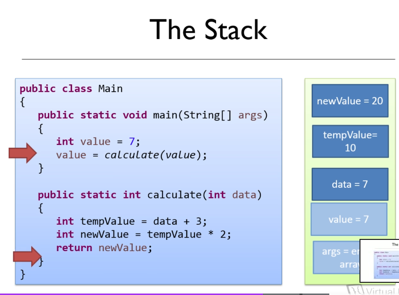
- **How the Heap works**
  - Here we **store objects**
    - The pointers (variable references) to those objects are stored in the Stack
  - All the data which is not in the Stack
  - **Shared by all the threads**
  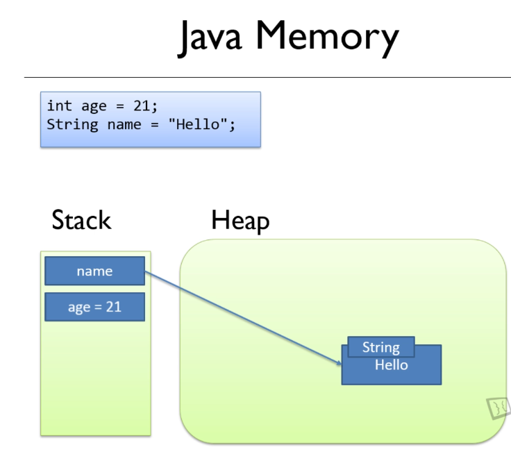
  - A primative `int` which is a class level attribute will be stored on the heap (it must be because it's only accessible from an object on the heap). It won't be stored as a pointer to another heap object though, simply as a value within the class level object.
- **The Heap and the Stack together: an example**
  - Objects are stored on the Heap
  - Variables are a reference to the object
  - Local variables are stored on the Stack
  - TBD
  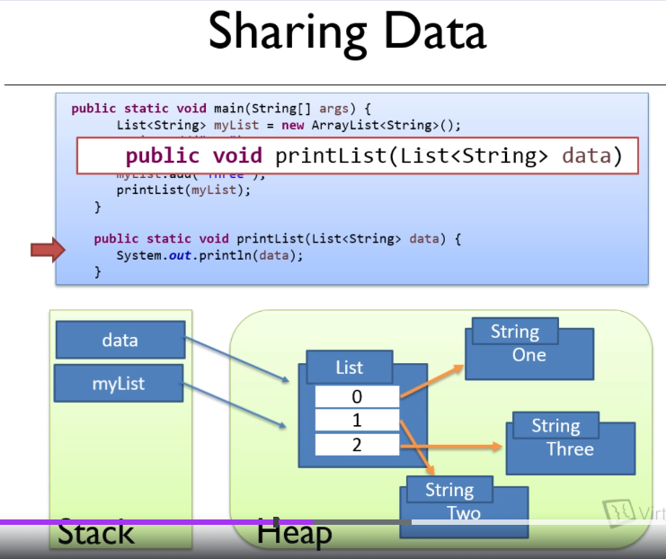
  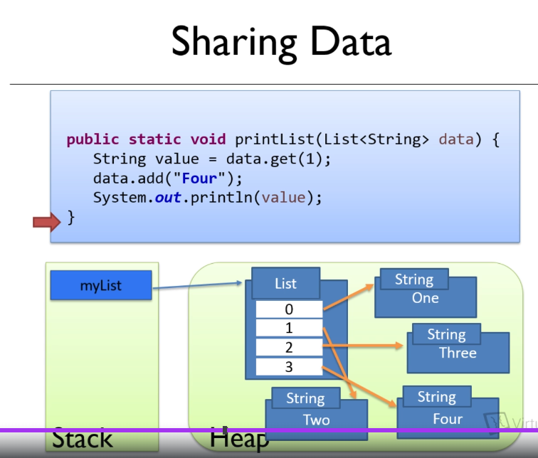

## Chapter 5 - Passing objects between methods

- Java project "ExploringMemory"
- Everything is **passed by value (copy)** between methods
  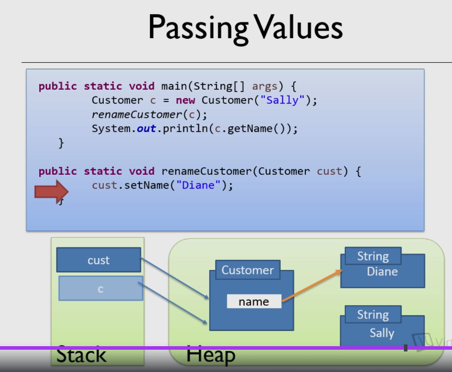
- `final` keyword
  - It is **not** the same as a constant
  - `final` variables can only be assigned ONCE.
    - That does NOT mean tha the referenced object can not be changed: IT CAN.
    - **The `final` keyword doesn't stop an object's values from being changed**
    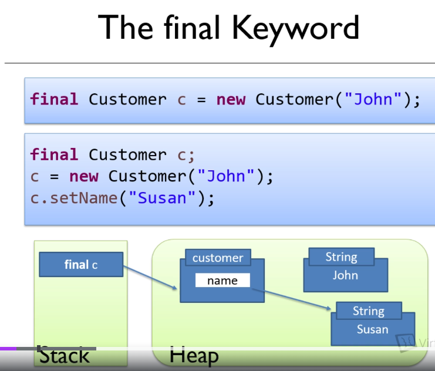
  - `final` methods can not be overwritten by subclasses
  - `final` classes can not be subclassed
  - Good for performance: it allows the JVM compiler to optimize the code with **inline**
- There is no **const** keyword

## Chapter 7 - Escaping References

- What is an escaping reference?
  - In a class, we have a method returning a pointer to a private object
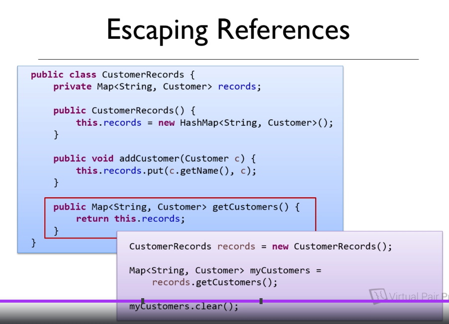
- **Strategy 1**: using an iterator
  - It is not a perfect solution: you could still mutate the inner elements.
  - Zero performance impact solution: no impact in the performance
  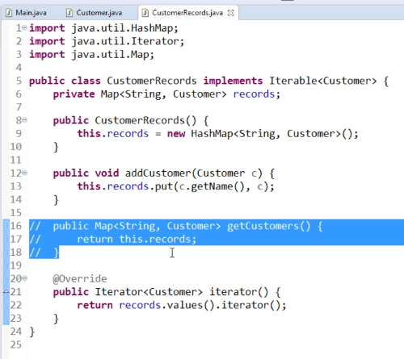
- **Strategy 2**: duplicating collections
  - Still, the users might change the underlying objects of the collection (e.g. Customer A and B)
  - They can also add more elements to the copy returned
  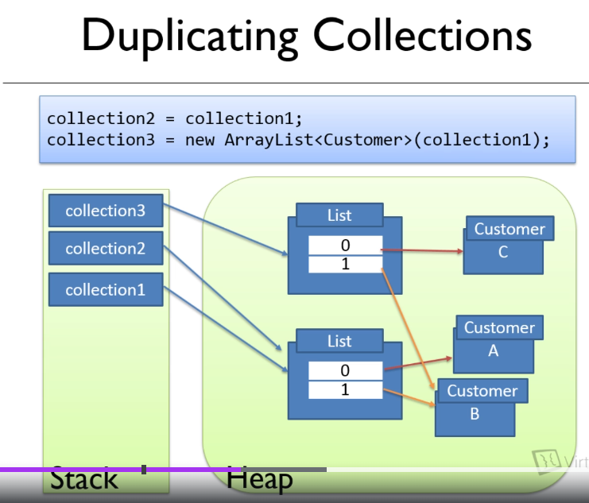
  - Performance impact:
    - some overhead for copying the references to a new copy to be returned.
    - small impact (e.g. 8 bytes per pointer)
- **Strategy 3**: using immutable collections
  - `Collections.unmodifiableXxx(existingXxx)`:
    - this does not create a copy, it returns an unmodifiable view of the Xxx, e.g. [unmodifiableMap](https://docs.oracle.com/javase/8/docs/api/java/util/Collections.html#unmodifiableMap-java.util.Map-)
    - The underlying Map in the view can still be modified where the copy wouldn't.
  - Java 10+: `Map.copyOf(existingMap)`: this does create a copy,
    - e.g. you wouldn't be able to add another element to the Map
- **Strategy 4**: duplicating objects
  - Return a read-only copy of the object. See method `find()`:
  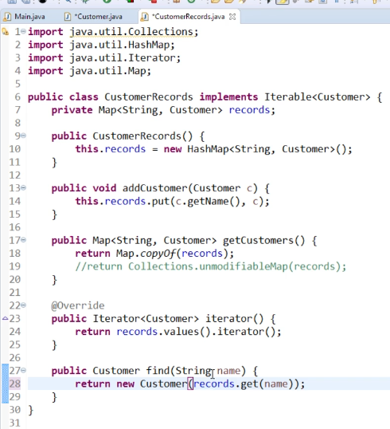
- **Strategy 5**: using interfaces to create immutable objects
  - Create `ReadonlyCustomer` interface which only contains `getName()` and `toString()`, NOT `setName()`. That way, you can not change it from the outside. And you return that interface.
  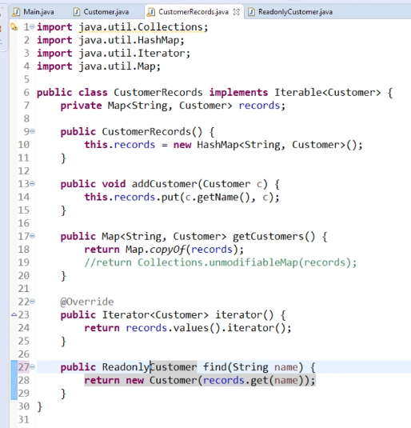
  - This is duplicating the object in the Heap (only the references and it's short-lived, it is a low impact solution)
- **Strategy 6**: using modules to hide the implementation
  - Java 9+: you can use the module system to package
  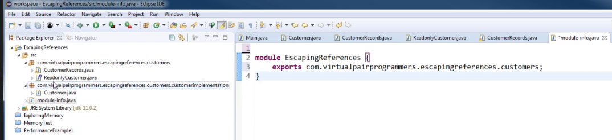

## Chapter 9 - The Metaspace and internal JVM memory optimisations

- Metaspace is used to **store metadata**: information about classes, methods, which methods are being compiled in bytecode, which are compiled in native code
- **Static primitives** are stored entirely in the Metaspace
- **Static objects** are stored in the Heap, with the object pointer/reference living in the Metaspace
- The static primitives and references are kept "for ever" in the Metaspace: their referenced objects in the Heap are NEVER collected.
- All threads in a program have access to the Metaspace, that's why static elements can be accessed from anywhere.
  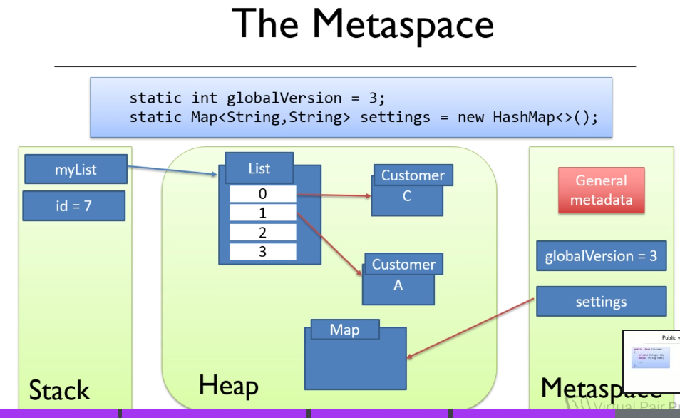
- Metaspace exists from Java8. In Java7 and below it existed the **PermGen**
  - there were problems with the PermGen: the possibility for applications using the PermGen for that area to be full (`java.lang.OutOfMemoryError: PermGen`; you could fix it tuning the JVM, `-XX:PermSize=N` and `-XX:MaxPermSize=N`). That should never happen with the Metaspace.
- Are objects always created on the heap?
  - Because objects are created in the Heap, they can be shared between methods.
- In other languages, you can decide where to store objects: stack or heap area. Not in Java.
- If the JVM detects that the object you declare inside a method is not going to be accessed outside a method, it might **create that object in the Stack**.
- The **String pool**
  - [Documentation from Digital Ocean about String Pool in Java](https://www.digitalocean.com/community/tutorials/what-is-java-string-pool)
  - In Java6 and below, the String pool lives in the PermGen space. From Java7+, it **lives in the Heap** (and they can be garbage collected).
  - Strings are immutable: two Stack variables point to the same String object in the Heap with the same value.
  - `String name = "myName"` goes to the String pool
  - `String name = new String("myName")`does NOT go to the String pool
  - But it does not happen if the String is a calculated String, e.g. a conversion from another type (see screenshot). `i.toString()`is not placed in the String pool
  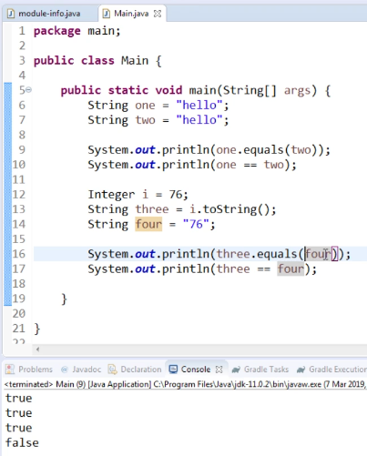
  - **Interning Strings**
    - Calling `.intern()` on a String will place it in the String pool. [More info](https://www.baeldung.com/string/intern).
  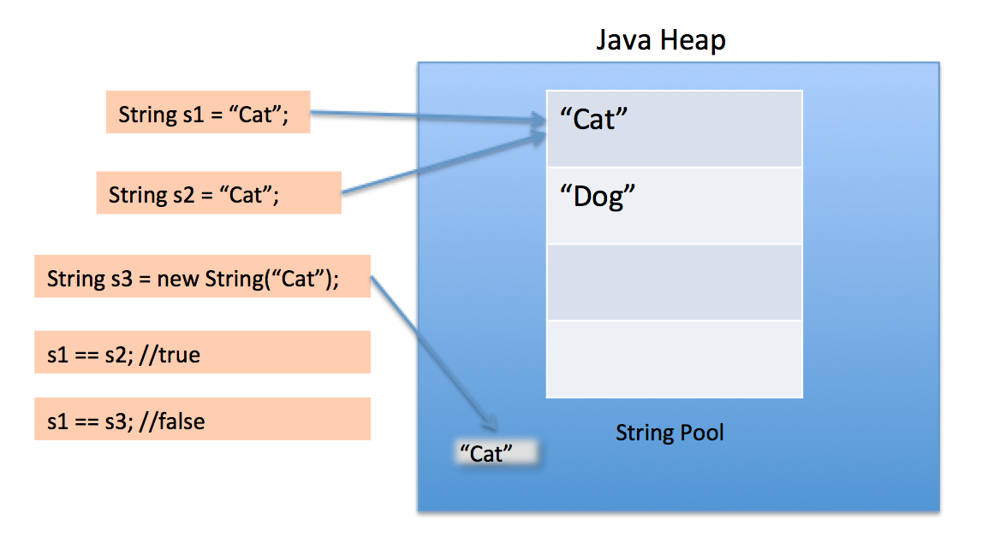

## Chapter 10 - Tuning the JVM's Memory Settings

- The String pool
  - is implemented using a HashMap.
  - it is like buckets (by default, 16 buckets in a HashMap)
  - the hash code of a string is used to see in which bucket will the String lives: there might be several strings in the same bucket
  - this way of storing is very performant: for a new String, you don't have to go through all of them to see if it is already stored. You hash it and see if it's already contained in that bucket.
- Possible problem: the size of the buckets
- `-XX:+PrintStringTableStatistics`, we get info about the Strings in our application
  - It does not work in OpenJDK 11
- The bigger the bucket size, the less efficient (you have go through more elements to know if the String is already stored there)  
- `-XX:StringTableSize=N`: how many buckets we want in our String Pool. To be optimal, **it should be a prime number**. If you raise a lot this number, the performance will probably improve (the bucket size will be lower)
- The **heap size** must be big enough to contain the String pool.
- It's better to configure an initial heap size (`-XX:InitialHeapSize=N`) a little big higher than the memory that we already know that it is needed.
- Shortcut syntax for heap tuning flags
  

## Chapter 11 - Introducing Garbage Collection

- TBD

## Chapter 12 - Monitoring the Heap

- TBD

## Chapter 13 - Analysing a heap dump

- TBD

## Chapter 14

- TBD

## Chapter 15

- TBD

## Chapter 16

- TBD

## Chapter 17

- TBD

## Chapter 18

- TBD

## Chapter 19

- TBD

## Chapter 20

- TBD

## Chapter 21

- TBD

## Chapter 22

- TBD

## Chapter 23

- TBD

## Chapter 24

- TBD

## Chapter 25

- TBD

## General stuff
- **Scalar Replacement**: If the JVM determines that the fields of an object can be broken into individual variables, it may avoid creating the object entirely.
- JVM Options: **Escape Analysis** can be controlled with JVM options like:
- `-XX:+DoEscapeAnalysis` (enabled by default since Java 6)
- `-XX:+EliminateAllocations` (eliminates heap allocation where possible)
- [Java String Interview Questions and Answers](https://www.digitalocean.com/community/tutorials/java-string-interview-questions-and-answers)

## Questions

 1. TBD
 