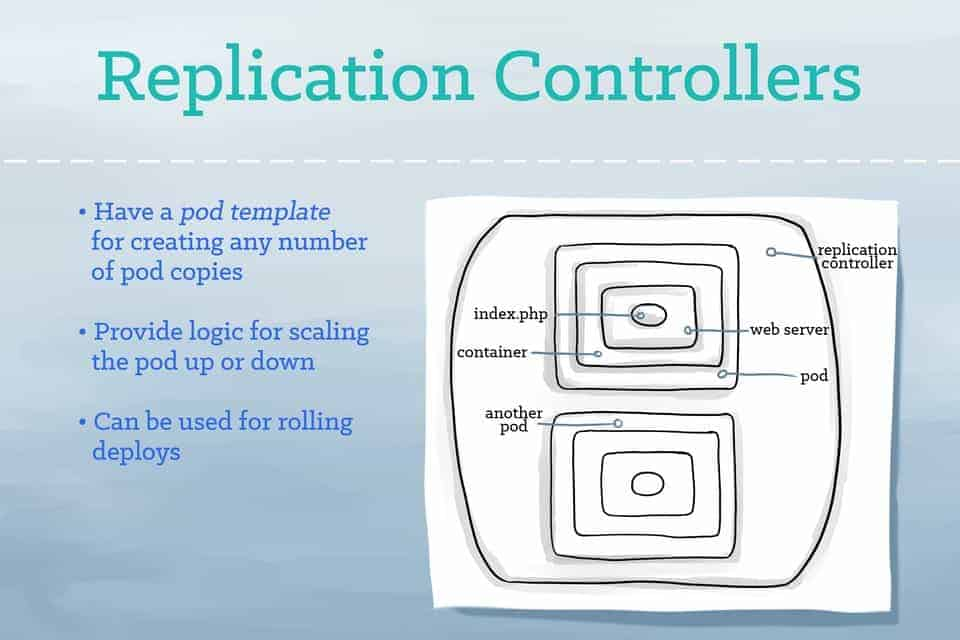
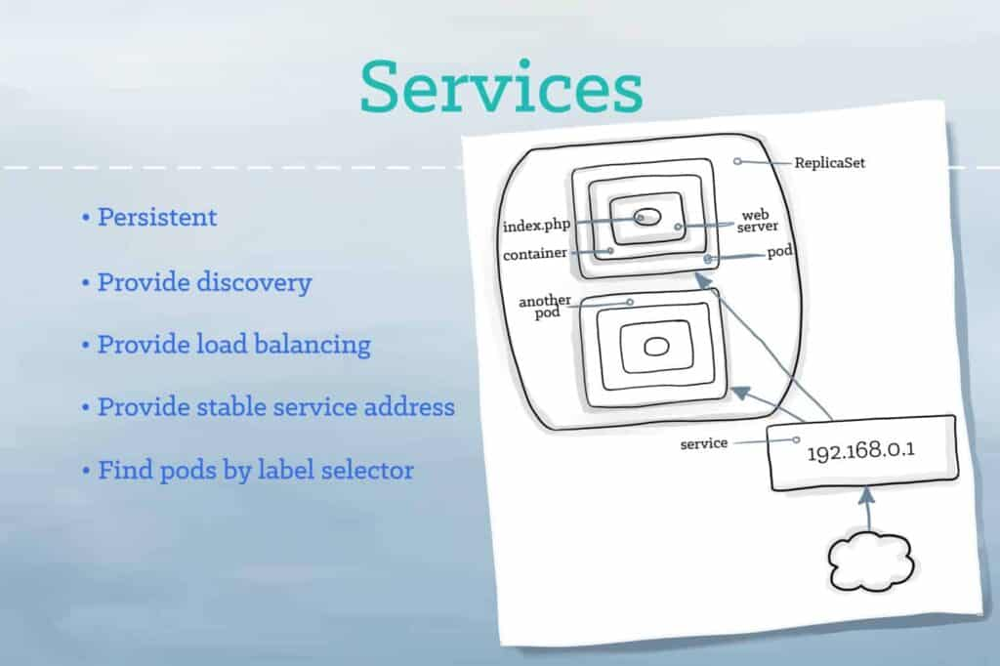
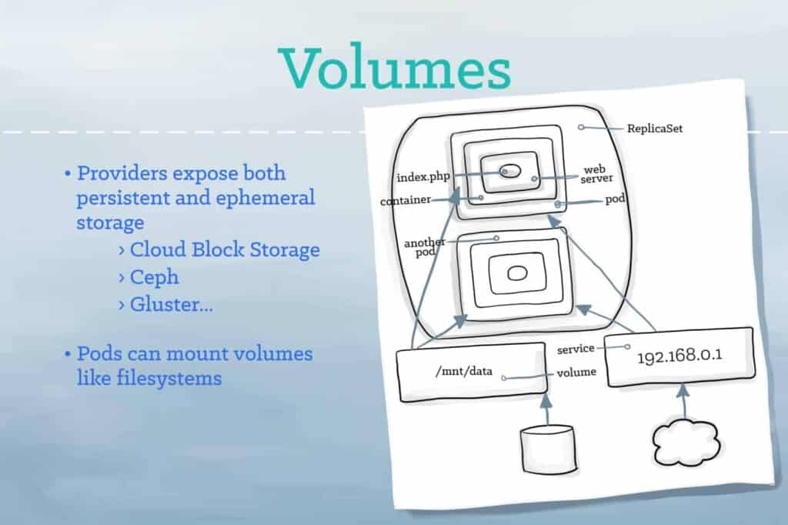

# CNCF Kubernetes stories
- https://www.cncf.io/phippy/

## The Illustrated Children’s Guide to Kubernetes
- https://www.cncf.io/phippy/the-childrens-illustrated-guide-to-kubernetes/
- Kubernetes: Phi-Beta-Kappa: Philsophia Biou Kubernetes (Love of Wisdom Pilots life)
- "Kubernetes” is the Greek word for a ship’s captain.
- A **container** provides an isolated environment in which an app, together with its environment, can run. But those isolated containers often need to be managed and connected to the external world. Shared file systems, networking, scheduling, load balancing, and distribution are all challenges.
- Kubernetes uses **labels** as “nametags” to identify things. And it can query based on these labels. Labels are open-ended: You can use them to indicate roles, stability, or other important attributes.
- A **Pod** represents a runnable unit of work.
    - Usually, you will run a **single container** inside of a Pod. But for cases where a few containers are tightly coupled, you may opt to run more than one container inside of the same Pod.
    - Kubernetes takes on the work of connecting your pod to the **network** and the rest of the Kubernetes environment.

- **Replication controllers** provide a method for managing an arbitrary number of pods. A replication controller contains a **pod template**, which can be replicated any number of times. Through the replication controller, Kubernetes will manage your **pods’ lifecycle**, including scaling up and down, rolling deployments, and monitoring.

- A **service** tells the rest of the Kubernetes environment (including other pods and replication controllers) what services your application provides. While pods come and go, the service IP addresses and ports remain the same. And other applications can find your service through Kurbenetes service discovery.

- A **volume** represents a location where containers can access and store information. For the application, the volume appears as part of the local filesystem. But volumes may be backed by local storage, Ceph, Gluster, Elastic Block Storage, and a number of other storage backends.

- A **namespace** functions as a **grouping mechanism** inside of Kubernetes. Services, pods, replication controllers, and volumes can easily cooperate within a namespace, but the namespace **provides a degree of isolation** from the other parts of the cluster.

## Phippy Goes to the Zoo
- https://www.cncf.io/phippy/phippy-goes-to-the-zoo-book/

- In Kubernetes, Pods are responsible for running your containers. Every Pod holds at least one container, and controls the execution of that container. When the containers exit, the Pod dies too.

- A **ReplicaSet** ensures that a set of identically configured Pods are running at the desired replica count. If a Pod drops off, the ReplicaSet brings a new one online as a replacement.
