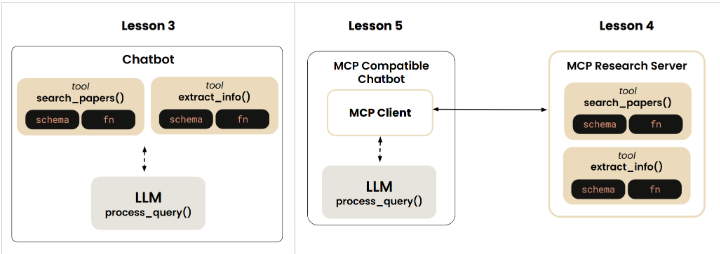
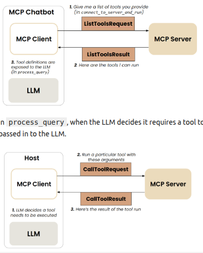
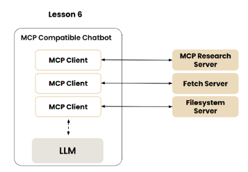

# MCP: Build Rich-Context AI Apps with Anthropic

- Instructor: Elie Schoppik
- Contributor: Hawraa Salami
- <https://www.deeplearning.ai/short-courses/mcp-build-rich-context-ai-apps-with-anthropic/>
- 1 h 38 min
- 11 video lessons

## Lesson 1: Why MCP

- MCP was launched by Anthropic in November of 2024.
- Models are only as good as the **context** given to them.
- Open source protocol: it standardizes how AI applications interact with external systems.
- **LSP** ([Language Server Protocol](https://microsoft.github.io/language-server-protocol/), based on JSON RPC): it standardizes how IDEs interact with language-specific tools.
- MCP servers are reusable by various AI applications.
- MPC servers provide tool schemas plus functions already defined for you.

## Lesson 2: MCP Architecture

- Notifications can be sent both ways.
- MCP Transports
    1. For servers running locally: **stdio**
    2. For remote servers:
        - HTTP+SSE (Server Sent Events)
            - For stateful connections
        - Streamable HTTP
            - It allows both stateful and stateless connections
            - HTTP or SSE
            - It is recommended. By default, it starts with stateless communication.

## Lesson 3: Chatbot example

- <https://s172-29-127-134p8888.lab-aws-production.deeplearning.ai/doc/tree/L3>
- [Guide on how to implement tool use](https://docs.anthropic.com/en/docs/agents-and-tools/tool-use/overview#how-to-implement-tool-use)
- The code is [here](./mcp-course-by-anthropic/L3_Chatbot_Example_MCP_Antrhopic_course.ipynb)

## Lesson 4: Creating an MCP Server

- We will wrap what we did in the last section and wrap it in an MCP server using the standard IO transport.
- We will use FastMCP
- The code is [here](./mcp-course-by-anthropic/L4_Creating_an_MCP_server_Antrhopic_course.ipynb)
- After following the instructions, we run an MCP inspector, accessible at <https://s172-29-127-134p6274.lab-aws-production.deeplearning.ai/#resources>
- Steps:

```bash
cd L4/mcp_project
uv init
uv venv
source .venv/bin/activate
uv add mcp arxiv
npx @modelcontextprotocol/inspector uv run research_server.py
# At the MCP inspector, fill the Proxy Address (unless run locally)
```

- [Example of low-level server](https://github.com/modelcontextprotocol/python-sdk/blob/main/examples/servers/simple-tool/mcp_simple_tool/server.py)
- [Advanced usage low-level server](https://github.com/modelcontextprotocol/python-sdk/blob/main/README.md#advanced-usage)
- [MCP inspector](https://github.com/modelcontextprotocol/inspector)
  - The MCP inspector is a developer tool for testing and debugging MCP servers.
- [Quickstart for server developers](https://modelcontextprotocol.io/quickstart/server)

## Lesson 5: Creating an MCP Client


- [Code example](mcp-course-by-anthropic/L5_MCP_Client_Anthropic_course.ipynb)
- In the example, the MCP client starts a local MCP server with `uv run research_server.py`
- The MCP client connects to the MCP server
- The MCP_ChatBot class consists of the methods:
  - `process_query`
  - `chat_loop`
  - `connect_to_server_and_run`
- ... and has the following attributes:
  - session (of type ClientSession)
  - anthropic: Anthropic
  - available_tools
- In `connect_to_server_and_run`, the client launches the server and requests the list of tools that the server provides (through the client session). The tool definitions are stored in the variable available_tools and are passed in to the LLM in `process_query`.



In `process_query`, when the LLM decides it requires a tool to be executed, the client session sends to the server the tool call request. **The returned response is passed in to the LLM**.



- Run:
```bash
cd L5/mcp_project
source .venv/bin/activate
uv add anthropic python-dotenv nest_asyncio
uv run mcp_chatbot.py
```
- Other resources
  - [Quick Start for Client Developpers](https://modelcontextprotocol.io/quickstart/client)
  - [Writing MCP client](https://github.com/modelcontextprotocol/python-sdk/blob/main/examples/clients/simple-chatbot/mcp_simple_chatbot/main.py)  
  - Another mcp chatbot example

## Lesson 6: Connecting the MCP Chatbot to Reference Servers

- [Code example](mcp-course-by-anthropic/L6_Connect_to_MCP_reference_servers_Anthropic_course.ipynb)
- [List of MCP servers](https://github.com/modelcontextprotocol/servers)
  - [fetch MCP Server](https://github.com/modelcontextprotocol/servers/tree/main/src/fetch)
  - [filesystem MCP Server](https://github.com/modelcontextprotocol/servers/tree/main/src/filesystem)
- We create a JSON file (`server_config.json`) with all the MCP server configuration needed to connect to the MCP Servers.



## Lesson 7: Adding Prompt & Resource Features

- [Code example](mcp-course-by-anthropic/L7_Adding_Prompt_and_Resource_features.ipynb)
- Resources are read-only data that an MCP server can expose to the LLM application. Resources are similar to GET endpoints in a REST API - they provide data but shouldn't perform significant computation or have side effects.

## Lesson 8: Configuring Servers for Claude Desktop

- TBD

## Lesson 9: Creating and deploying remote servers

- TBD

## Lesson 10: TBD

- TBD

## Lesson 11: TBD

- TBD
